NGINX Plus の設定
####

0. (事前準備) NGINX Plusのインストール
====

1. NGINX Plusのインストール・基礎
----

| 以下のページの内容を参考にNGINX Plus及びモジュールをインストールします
| `NGINX Plus Lab 1. NGINX Plusのインストール (15min) <https://f5j-nginx-plus-lab1.readthedocs.io/en/latest/class1/module2/module2.html#nginx-plus-15min>`__

| また、このラボは以下の内容を理解していることを前提としています。
| 初めてNGINX Plusを操作する方は、以下より基本的な挙動について確認をしてください。
- `NGINX Plus Lab 3. 基本的な動作の確認 <https://f5j-nginx-plus-lab1.readthedocs.io/en/latest/class1/module2/module2.html#id3>`__ を参照してください

2. 環境の初期セットアップ
----

以降のラボで利用するファイルを取得します

.. code-block:: cmdin

  cd ~/
  git clone https://github.com/BeF5/f5j-nginx-plus-lab2-conf

共通設定としてNGINX Plus API、Dashboardの設定をコピーします

.. code-block:: cmdin

  sudo cp ~/f5j-nginx-plus-lab2-conf/lab/api.conf /etc/nginx/conf.d/
  sudo nginx -s reload

F5ラボ環境を利用の場合、以下のどちらかの手段で接続してください

- ``(推奨)リモートデスクトップに接続している場合`` 、 `http://10.1.1.7:8888/dashboard.html <http://10.1.1.7:8888/dashboard.html>`__ を開いてください
- ``リモートデスクトップを利用していない場合`` 、ご利用の端末から接続するため、 ``ubuntu01`` の接続メニューより ``PLUS  DASHBOARD`` を選択してください

1. 流量制御(Rate limit)
====

Rate Limitの設定を紹介します。

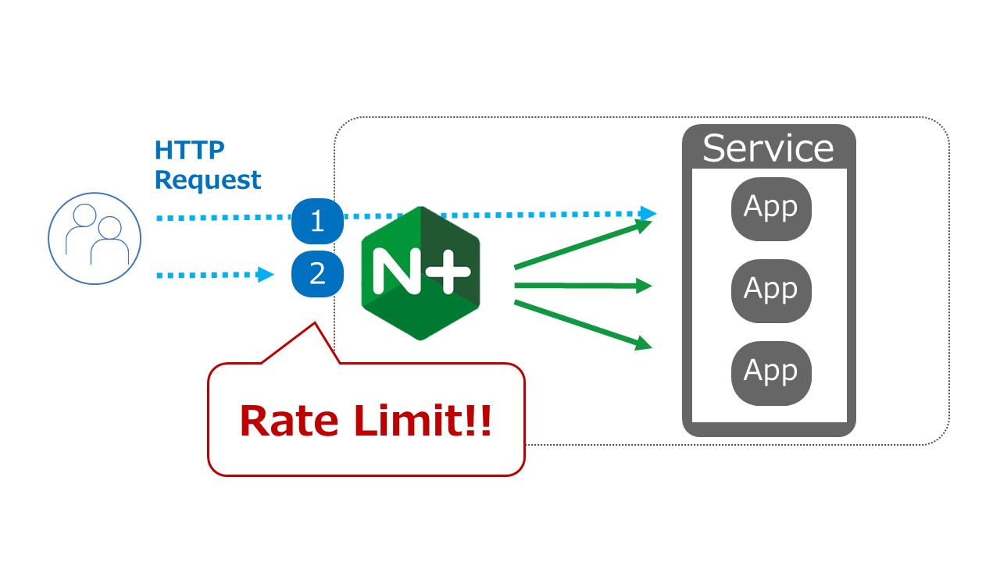

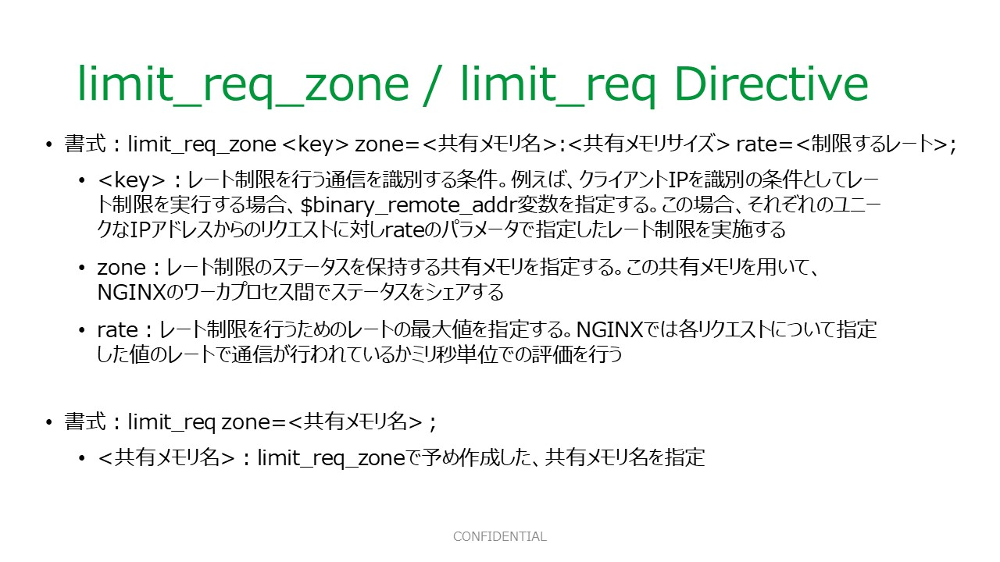

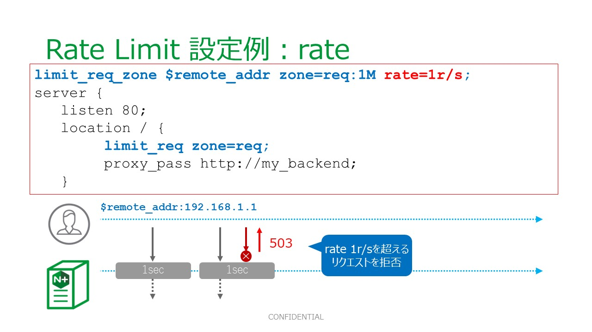

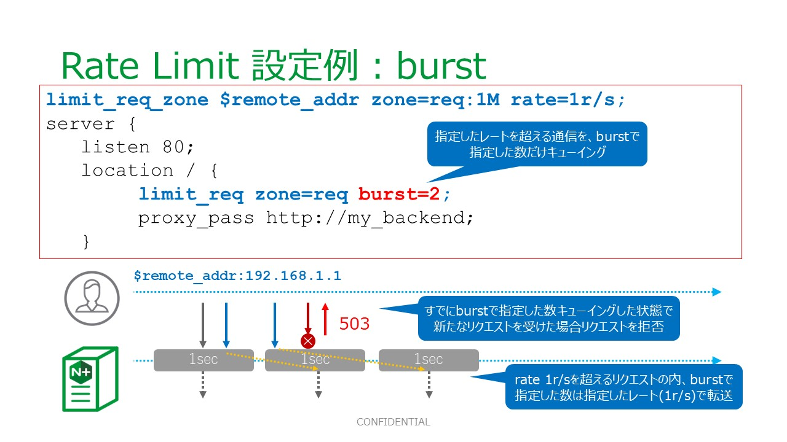

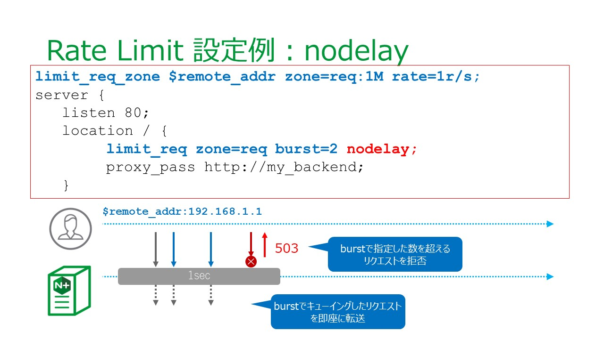

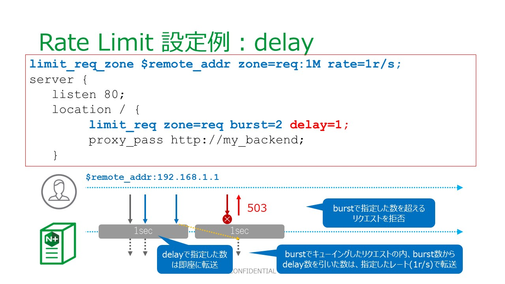

使用するディレクティブの詳細は以下のページを参照してください。

- HTTP Request Limit の詳細: `ngx_http_limit_req_module <http://nginx.org/en/docs/http/ngx_http_limit_req_module.html>`__ 
- HTTP API Status Zone の詳細:  `ngx_http_api_module status_zone <http://nginx.org/en/docs/http/ngx_http_api_module.html#status_zone>`__

1. ratelimit
----

設定
~~~~

設定内容を確認します

.. code-block:: cmdin

  cat ~/f5j-nginx-plus-lab2-conf/lab/ratelimit1.conf

.. code-block:: bash
  :caption: 実行結果サンプル
  :linenos:
  :emphasize-lines: 1,13-14

  limit_req_zone $remote_addr zone=req:1M rate=1r/s;
  
  upstream server_group {
      zone backend 64k;
  
      server backend1:81;
  }
  
  server {
     listen 80;
     #status_zone server;
     location / {
         status_zone root;
         limit_req zone=req;
         proxy_pass http://server_group;
     }
  }

- 1行目で、Rate Limit を設定します。 Request Limit の Key を ``$remote_addr`` 、 zone名を ``req``、rate を ``1r/s(1秒間1リクエスト)`` と指定しています。これらにより、同一の送信元IPアドレスに対し、指定したリクエストのみを許可するルールとなります
- 14行目で、zone名を指定する事によりポリシーを選択・適用します。複数の limit_req_zone を定義した場合、Zone名を切り替える事により適用ルールを選択することが可能です
- 13行目で、status_zone を記述し、 ``root`` という名称の location status zone を指定しています。NGINX Plusではこの機能により、Rate Limitの状況を確認することが可能です

設定を反映します

.. code-block:: cmdin

  sudo cp ~/f5j-nginx-plus-lab2-conf/lab/ratelimit1.conf /etc/nginx/conf.d/default.conf
  sudo nginx -s reload

動作確認
~~~~

動作を確認します。

| ステータスを確認するためNGINX Plusのダッシュボードを開いてください。
| 画面上部 ``HTTP Zones`` のタブを選択してください。

以下のコマンドを実行し、動作を確認します。

.. code-block:: cmdin

  for i in {1..3}; do echo "==$i==" ; curl -I -s localhost ; done

.. code-block:: bash
  :caption: 実行結果サンプル
  :linenos:
  :emphasize-lines: 2,10,18

  ==1==
  HTTP/1.1 200 OK
  Server: nginx/1.21.6
  Date: Thu, 22 Sep 2022 07:07:33 GMT
  Content-Type: application/octet-stream
  Content-Length: 505
  Connection: keep-alive
  
  ==2==
  HTTP/1.1 503 Service Temporarily Unavailable
  Server: nginx/1.21.6
  Date: Thu, 22 Sep 2022 07:07:33 GMT
  Content-Type: text/html
  Content-Length: 197
  Connection: keep-alive
  
  ==3==
  HTTP/1.1 503 Service Temporarily Unavailable
  Server: nginx/1.21.6
  Date: Thu, 22 Sep 2022 07:07:33 GMT
  Content-Type: text/html
  Content-Length: 197
  Connection: keep-alive

- 1回目の実行で、 ``200 OK`` が応答されていることが確認できます
- 2回目、3回目は、Rate Limit により ``503 Service Temorarily Unavailable`` が応答されていることがわかります。

Error Log の内容を確認します

.. code-block:: cmdin

  tail -2 /var/log/nginx/error.log | grep limiting

.. code-block:: bash
  :caption: 実行結果サンプル
  :linenos:

  2022/09/22 16:07:33 [error] 23556#23556: *1493 limiting requests, excess: 0.990 by zone "req", client: 127.0.0.1, server: , request: "HEAD / HTTP/1.1", host: "localhost"
  2022/09/22 16:07:33 [error] 23555#23555: *1494 limiting requests, excess: 0.981 by zone "req", client: 127.0.0.1, server: , request: "HEAD / HTTP/1.1", host: "localhost"

zone ``req`` で Rate Limit が2件記録されていることが確認できます

Access Log の内容を確認します

.. code-block:: cmdin

  grep HEAD /var/log/nginx/access.log | tail -3

.. code-block:: bash
  :caption: 実行結果サンプル
  :linenos:

  127.0.0.1 - - [22/Sep/2022:16:07:33 +0900] "HEAD / HTTP/1.1" 200 0 "-" "curl/7.68.0" "-"
  127.0.0.1 - - [22/Sep/2022:16:07:33 +0900] "HEAD / HTTP/1.1" 503 0 "-" "curl/7.68.0" "-"
  127.0.0.1 - - [22/Sep/2022:16:07:33 +0900] "HEAD / HTTP/1.1" 503 0 "-" "curl/7.68.0" "-"

1行目は、 ``200`` が応答されており、 2,3行目は ``503`` が応答されていることが確認できます

NGINX Plus Dashboardの内容は以下のように表示されます

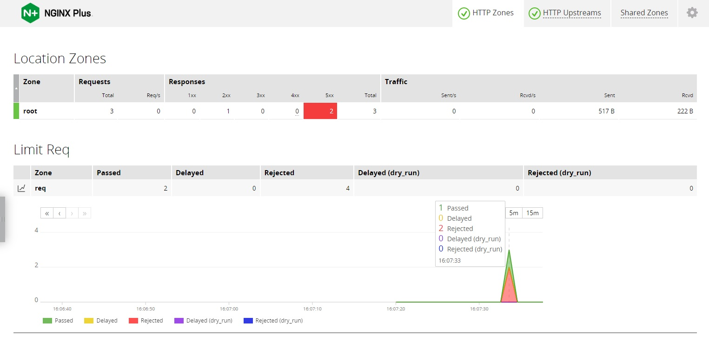

- Location Zone の表より ``5xx`` が ``2`` となっていることがわかります
- Limit Req のグラフより ``Passed`` が ``1`` 、 ``Rejected`` が ``2`` となっていることがわかります

2. burst, nodelay(delay)
----

設定
~~~~

設定内容を確認します

.. code-block:: cmdin

  cat ~/f5j-nginx-plus-lab2-conf/lab/ratelimit2-burst-nodelay.conf

.. code-block:: bash
  :caption: 実行結果サンプル
  :linenos:
  :emphasize-lines: 1,13-14

  limit_req_zone $remote_addr zone=req:1M rate=1r/s;
  
  upstream server_group {
      zone backend 64k;
  
      server backend1:81;
  }
  
  server {
     listen 80;
     #status_zone server;
     location / {
         status_zone root;
         limit_req zone=req burst=2 nodelay;
         proxy_pass http://server_group;
     }
  }

- `1. ratelimit <https://f5j-nginx-plus-lab2.readthedocs.io/en/latest/class1/module02/module02.html#ratelimit>`__ の内容との差分を紹介します
- 14行目で、 ``burst=2`` 、 ``nodelay`` オプションを指定し、zone req の limit_req を適用します

.. code-block:: cmdin

  sudo cp ~/f5j-nginx-plus-lab2-conf/lab/ratelimit2-burst-nodelay.conf /etc/nginx/conf.d/default.conf
  sudo nginx -s reload

動作確認
~~~~

動作を確認します。

| ステータスを確認するためNGINX Plusのダッシュボードを開いてください。
| 画面上部 ``HTTP Zones`` のタブを選択してください。

以下のコマンドを実行し、動作を確認します。

.. code-block:: cmdin

  for i in {1..4}; do echo "==$i==" ; curl -I -s localhost ; done

.. code-block:: bash
  :caption: 実行結果サンプル
  :linenos:
  :emphasize-lines: 2,10,18,26

  ==1==
  HTTP/1.1 200 OK
  Server: nginx/1.21.6
  Date: Thu, 22 Sep 2022 07:10:20 GMT
  Content-Type: application/octet-stream
  Content-Length: 505
  Connection: keep-alive
  
  ==2==
  HTTP/1.1 200 OK
  Server: nginx/1.21.6
  Date: Thu, 22 Sep 2022 07:10:20 GMT
  Content-Type: application/octet-stream
  Content-Length: 505
  Connection: keep-alive
  
  ==3==
  HTTP/1.1 200 OK
  Server: nginx/1.21.6
  Date: Thu, 22 Sep 2022 07:10:20 GMT
  Content-Type: application/octet-stream
  Content-Length: 505
  Connection: keep-alive
  
  ==4==
  HTTP/1.1 503 Service Temporarily Unavailable
  Server: nginx/1.21.6
  Date: Thu, 22 Sep 2022 07:10:20 GMT
  Content-Type: text/html
  Content-Length: 197
  Connection: keep-alive

- 1-3回目の実行で、 ``200 OK`` が応答されていることが確認できます。これは ``burst=2`` で指定した数だけ、指定のLimitを超過するアクセスが許可されています
- 4回目の実行で、Rate Limit により ``503 Service Temorarily Unavailable`` が応答されていることがわかります。

Error Log の内容を確認します

.. code-block:: cmdin

  tail -2 /var/log/nginx/error.log | grep limiting

.. code-block:: bash
  :caption: 実行結果サンプル
  :linenos:

  2022/09/22 16:10:20 [error] 23778#23778: *1507 limiting requests, excess: 2.972 by zone "req", client: 127.0.0.1, server: , request: "HEAD / HTTP/1.1", host: "localhost"

zone ``req`` で Rate Limit が記録されていることが確認できます

Access Log の内容を確認します

.. code-block:: cmdin

  grep HEAD /var/log/nginx/access.log | tail -4

.. code-block:: bash
  :caption: 実行結果サンプル
  :linenos:

  127.0.0.1 - - [22/Sep/2022:16:10:20 +0900] "HEAD / HTTP/1.1" 200 0 "-" "curl/7.68.0" "-"
  127.0.0.1 - - [22/Sep/2022:16:10:20 +0900] "HEAD / HTTP/1.1" 200 0 "-" "curl/7.68.0" "-"
  127.0.0.1 - - [22/Sep/2022:16:10:20 +0900] "HEAD / HTTP/1.1" 200 0 "-" "curl/7.68.0" "-"
  127.0.0.1 - - [22/Sep/2022:16:10:20 +0900] "HEAD / HTTP/1.1" 503 0 "-" "curl/7.68.0" "-"

1-3行目は、 ``200`` が応答されており、 2,3行目は ``503`` が応答されていることが確認できます

NGINX Plus Dashboardの内容は以下のように表示されます

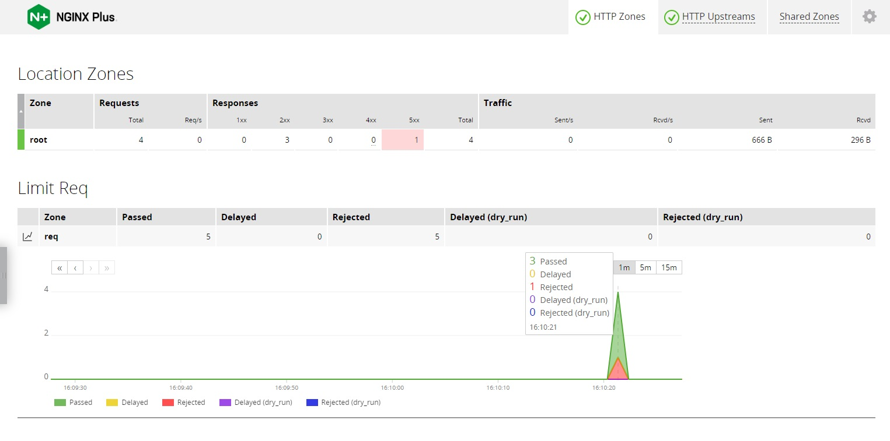

- Location Zone の表より ``5xx`` が ``1`` となっていることがわかります
- Limit Req のグラフより ``Passed`` が ``3`` 、 ``Rejected`` が ``1`` となっていることがわかります

3. dry run
----

設定
~~~~

設定内容を確認します

.. code-block:: cmdin

  cat ~/f5j-nginx-plus-lab2-conf/lab/ratelimit3-dryrun.conf

.. code-block:: bash
  :caption: 実行結果サンプル
  :linenos:
  :emphasize-lines: 1,13-15

  limit_req_zone $remote_addr zone=req:1M rate=1r/s;
  
  upstream server_group {
      zone backend 64k;
  
      server backend1:81;
  }
  
  server {
     listen 80;
     #status_zone server;
     location / {
         status_zone root;
         limit_req zone=req burst=2 nodelay;
         limit_req_dry_run on;
         proxy_pass http://server_group;
     }
  }

- `1. ratelimit <https://f5j-nginx-plus-lab2.readthedocs.io/en/latest/class1/module02/module02.html#ratelimit>`__ の内容との差分を紹介します
- 15行目で、 ``limit_req_dry_run`` ``on`` を指定します。このオプションにより、実際に通信は拒否せず、ステータスの確認が可能となります

.. code-block:: cmdin

  sudo cp ~/f5j-nginx-plus-lab2-conf/lab/ratelimit3-dryrun.conf /etc/nginx/conf.d/default.conf
  sudo nginx -s reload

動作確認
~~~~

動作を確認します。

| ステータスを確認するためNGINX Plusのダッシュボードを開いてください。
| 画面上部 ``HTTP Zones`` のタブを選択してください。

以下のコマンドを実行し、動作を確認します。

.. code-block:: cmdin

  for i in {1..4}; do echo "==$i==" ; curl -I -s localhost ; done

.. code-block:: bash
  :caption: 実行結果サンプル
  :linenos:
  :emphasize-lines: 2,10,18,26

  ==1==
  HTTP/1.1 200 OK
  Server: nginx/1.21.6
  Date: Thu, 22 Sep 2022 07:20:18 GMT
  Content-Type: application/octet-stream
  Content-Length: 505
  Connection: keep-alive
  
  ==2==
  HTTP/1.1 200 OK
  Server: nginx/1.21.6
  Date: Thu, 22 Sep 2022 07:20:18 GMT
  Content-Type: application/octet-stream
  Content-Length: 505
  Connection: keep-alive
  
  ==3==
  HTTP/1.1 200 OK
  Server: nginx/1.21.6
  Date: Thu, 22 Sep 2022 07:20:18 GMT
  Content-Type: application/octet-stream
  Content-Length: 505
  Connection: keep-alive
  
  ==4==
  HTTP/1.1 200 OK
  Server: nginx/1.21.6
  Date: Thu, 22 Sep 2022 07:20:18 GMT
  Content-Type: application/octet-stream
  Content-Length: 505
  Connection: keep-alive

すべての実行結果が ``200 OK`` となり、通信が拒否されていないことがわかります

Error Log の内容を確認します

.. code-block:: cmdin

  tail -2 /var/log/nginx/error.log | grep limiting

.. code-block:: bash
  :caption: 実行結果サンプル
  :linenos:

  2022/09/22 16:20:18 [error] 23890#23890: *1532 limiting requests, dry run, excess: 2.953 by zone "req", client: 127.0.0.1, server: , request: "HEAD / HTTP/1.1", host: "localhost"

通信は拒否されていませんでしたが、zone ``req`` で Rate Limit の ``Dry Run`` が記録されていることが確認できます

Access Log の内容を確認します

.. code-block:: cmdin

  grep HEAD /var/log/nginx/access.log  | tail -4

.. code-block:: bash
  :caption: 実行結果サンプル
  :linenos:
  :emphasize-lines: 7

  127.0.0.1 - - [22/Sep/2022:16:20:18 +0900] "HEAD / HTTP/1.1" 200 0 "-" "curl/7.68.0" "-"
  127.0.0.1 - - [22/Sep/2022:16:20:18 +0900] "HEAD / HTTP/1.1" 200 0 "-" "curl/7.68.0" "-"
  127.0.0.1 - - [22/Sep/2022:16:20:18 +0900] "HEAD / HTTP/1.1" 200 0 "-" "curl/7.68.0" "-"
  127.0.0.1 - - [22/Sep/2022:16:20:18 +0900] "HEAD / HTTP/1.1" 200 0 "-" "curl/7.68.0" "-"

すべての結果で ``200`` が応答されており、通信の拒否がないことが確認できます

NGINX Plus Dashboardの内容は以下のように表示されます

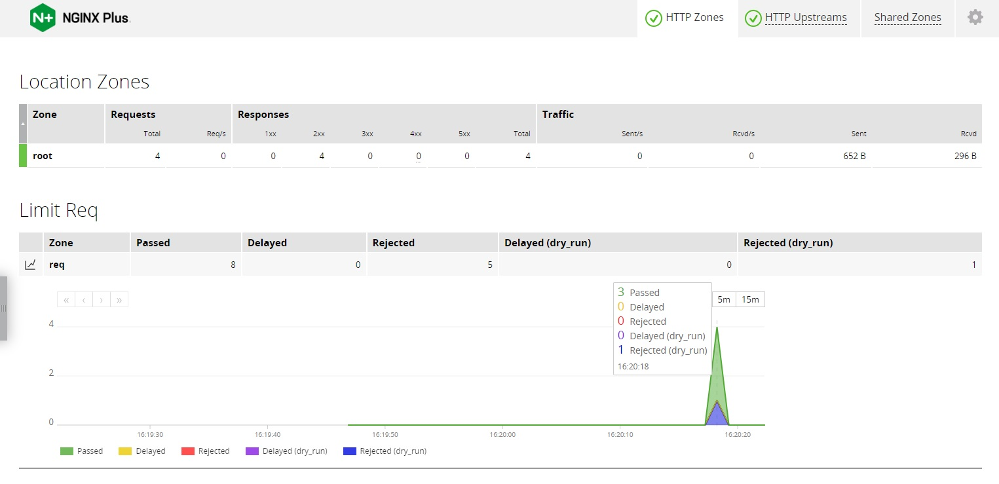

- Location Zone の表より ``5xx`` に該当はなく ``2xx`` が ``4`` となっていることがわかります
- Limit Req のグラフより ``Passed`` が ``3`` 、 ``Rejected (dry_run)`` が ``1`` となっていることがわかります

2. 流量制御(Connection limit)
====

Connection Limitの設定を紹介します。

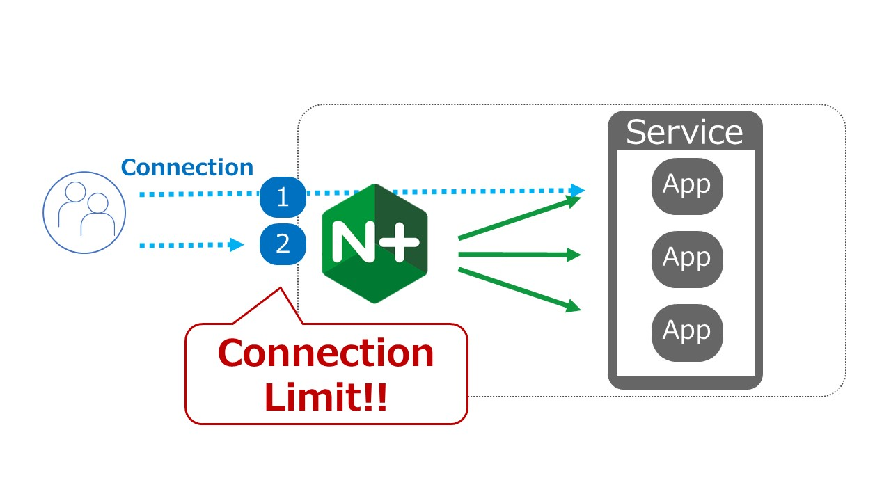

使用するディレクティブの詳細は以下のページを参照してください。

- HTTP Connection Limit の詳細: `ngx_http_limit_conn_module <http://nginx.org/en/docs/http/ngx_http_limit_conn_module.html>`__ 
- HTTP API Status Zone の詳細:  `ngx_http_api_module status_zone <http://nginx.org/en/docs/http/ngx_http_api_module.html#status_zone>`__

設定
----

設定内容を確認します

.. code-block:: cmdin

  cat ~/f5j-nginx-plus-lab2-conf/lab/connlimit1.conf

.. code-block:: bash
  :caption: 実行結果サンプル
  :linenos:
  :emphasize-lines: 1,13-14

  limit_conn_zone $binary_remote_addr zone=addr:10m;
  
  upstream server_group {
      zone backend 64k;
  
      server backend1:83;
  }
  
  server {
     listen 80;
     #status_zone server;
     location / {
         status_zone root;
         limit_conn addr 1;
         proxy_pass http://server_group;
     }
  }

- 1行目で、Connection limit を設定します。 Connection Limit の Key を ``$remote_addr`` 、 zone名を ``addr`` と指定しています。これらにより、同一の送信元IPアドレスに対しコネクションリミットを適用します
- 14行目で、zone名 ``addr`` を指定する事によりポリシーを選択・適用します。また、許可するコネクションの数として ``1`` を指定します
- 13行目で、status_zone を記述し、 ``root`` という名称の location status zone を指定しています。NGINX Plusではこの機能により、Connection Limitの状況を確認することが可能です

設定を反映します

.. code-block:: cmdin

  sudo cp ~/f5j-nginx-plus-lab2-conf/lab/connlimit1.conf /etc/nginx/conf.d/default.conf
  sudo nginx -s reload

動作確認
----

| 以下コマンドを2回入力し、動作を確認してください。
| ラボの環境では上記設定5行目の ``backend1:83`` が1秒間コネクションを維持した後、応答する動作となります。
| curlコマンドを即座にバックグラウンドで続けて ``2回`` 実行することで、 ``1回目`` 処理中に、 ``2回目`` のリクエストが到達する状態とします。

.. code-block:: cmdin

  curl -I -s localhost &

.. code-block:: bash
  :caption: 実行結果サンプル
  :linenos:
  :emphasize-lines: 1,3,4,6,15

  $ curl -I -s localhost &  << 1回目のリクエストを実行
  [1] 24683
  $ << 1回目のリクエストの結果を待たず、プロンプトが表示される
  $ curl -I -s localhost &  << 2回目のリクエストを実行
  [2] 24685
  HTTP/1.1 503 Service Temporarily Unavailable
  Server: nginx/1.21.6
  Date: Thu, 22 Sep 2022 08:10:40 GMT
  Content-Type: text/html
  Content-Length: 197
  Connection: keep-alive
  
  
  [2]+  Done                    curl -I -s "localhost/wait?msec=5000"
  HTTP/1.1 200 OK
  Server: nginx/1.21.6
  Date: Thu, 22 Sep 2022 08:10:44 GMT
  Content-Type: application/octet-stream
  Content-Length: 13
  Connection: keep-alive

- 1行目で1回目のリクエストを実行しています。その後続けて、4行目で2回目のリクエストを実行しています
- 1回目のリクエストは正しく処理中となりますが、続けて実行された2回目のリクエストは Connection Limit により即座に ``503 Service Temporarily Unavaiable`` が応答されます
- その後、一定時間経過後、 15行目に示す通り 1回目の実行結果が表示されます

Error Log の内容を確認します

.. code-block:: cmdin

  tail -2 /var/log/nginx/error.log | grep limiting

.. code-block:: bash
  :caption: 実行結果サンプル
  :linenos:

  2022/09/23 17:41:26 [error] 2646#2646: *1186 limiting connections by zone "addr", client: 127.0.0.1, server: , request: "HEAD / HTTP/1.1", host: "localhost"

zone ``addr`` で Cnnection limit により通信が拒否されていることがわかります

Access Log の内容を確認します

.. code-block:: cmdin

  grep HEAD /var/log/nginx/access.log | tail -2

.. code-block:: bash
  :caption: 実行結果サンプル
  :linenos:

  127.0.0.1 - - [23/Sep/2022:17:41:26 +0900] "HEAD / HTTP/1.1" 503 0 "-" "curl/7.68.0" "-"
  127.0.0.1 - - [23/Sep/2022:17:41:27 +0900] "HEAD / HTTP/1.1" 200 0 "-" "curl/7.68.0" "-"

実施した結果と同様に、先に ``503`` の結果が記録されており、その後に ``200`` の結果が表示されていることが確認できます

NGINX Plus Dashboardの内容は以下のように表示されます

.. image:: ./media/nginx-connlimit1.jpg
   :width: 500

- Location Zone の表より ``5xx`` が ``1`` となっていることがわかります
- Limit Req のグラフより ``Passed`` が ``1`` 、 ``Rejected`` が ``1`` となっていることがわかります

3. ロードバランシングメソッド
====

ロードバランシングメソッドの設定を紹介します。

使用するディレクティブや設定の解説は以下のページを参照してください。

- HTTP Upstream の詳細: `ngx_http_upstream_module <http://nginx.org/en/docs/http/ngx_http_upstream_module.html>`__ 
- HTTP Load Balancing解説:  `HTTP Load Balancing <https://docs.nginx.com/nginx/admin-guide/load-balancer/http-load-balancer/>`__

1. round robin (default)
----

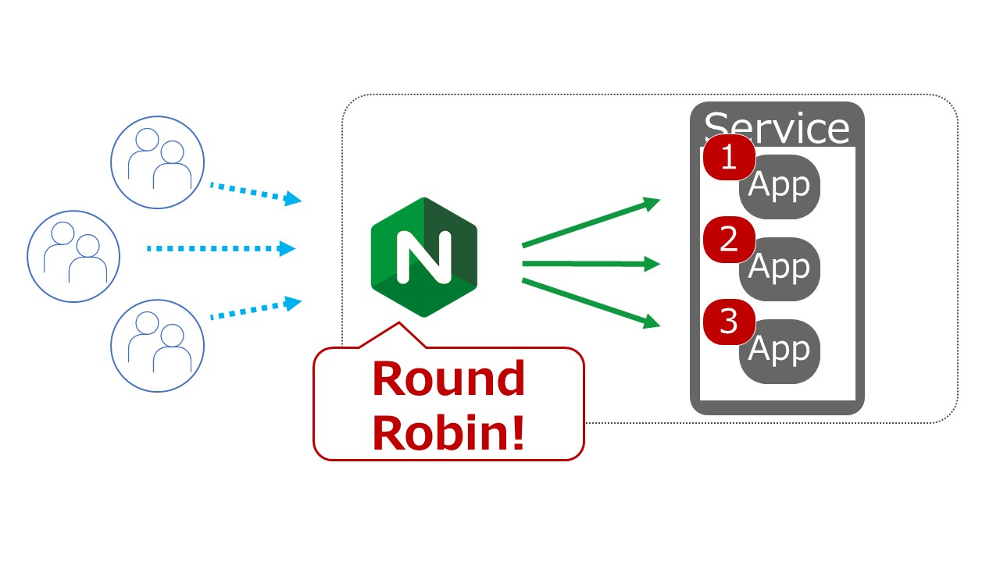

設定
~~~~

設定内容を確認します

.. code-block:: cmdin

  cat ~/f5j-nginx-plus-lab2-conf/lab/lb1.conf

.. code-block:: bash
  :caption: 実行結果サンプル
  :linenos:
  :emphasize-lines: 1-7

  upstream server_group {
      zone backend 64k;
  
      server backend1:81;
      server backend1:82;
      server backend1:83;
  }
  
  server {
     listen 80;
     location / {
         proxy_pass http://server_group;
     }
  }

- 1-7行目が、ロードバランシングに該当する設定となります
- この記述ではロードバランシングメソッドを記述していません。この場合には、 ``Round Robin`` の動作となります

設定を反映します

.. code-block:: cmdin

  sudo cp ~/f5j-nginx-plus-lab2-conf/lab/lb1.conf /etc/nginx/conf.d/default.conf
  sudo nginx -s reload

動作確認
~~~~

動作を確認します。

| ステータスを確認するためNGINX Plusのダッシュボードを開いてください。
| 画面上部 ``HTTP Upstreams`` のタブを選択してください。

以下のコマンドを実行し、動作を確認します。

.. code-block:: cmdin

  for i in {1..6}; do echo "==$i==" ; curl -s localhost/; echo""; sleep 1 ; done

.. code-block:: bash
  :caption: 実行結果サンプル
  :linenos:

  ==1==
  { "request_uri": "/","server_addr":"10.1.1.8","server_port":"81"}
  ==2==
  { "request_uri": "/","server_addr":"10.1.1.8","server_port":"82"}
  ==3==
  { "request_uri": "/","server_addr":"10.1.1.8","server_port":"83"}
  ==4==
  { "request_uri": "/","server_addr":"10.1.1.8","server_port":"81"}
  ==5==
  { "request_uri": "/","server_addr":"10.1.1.8","server_port":"82"}
  ==6==
  { "request_uri": "/","server_addr":"10.1.1.8","server_port":"83"}

結果を確認すると、 ``server_port`` が ``81`` 、 ``82`` 、 ``83`` 、という順序の応答が確認できます 

NGINX Plus Dashboardの内容は以下のように表示されます

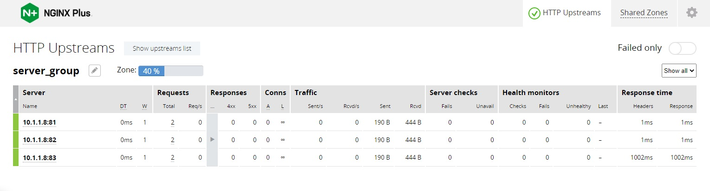

- ``Server`` の列に、ポート番号 ``81`` 、 ``82`` 、 ``83`` の3つが宛先として表示されています
- ``Requests`` の列を見ると、各 ``2`` となっており、均一に分散されていることが確認できます
- 右端 ``Response time`` の列を見ると、 ``83`` のホストは応答が遅いことが確認できますが、その応答状況に関わらず均一の分散となっています

2. ip_hash
----

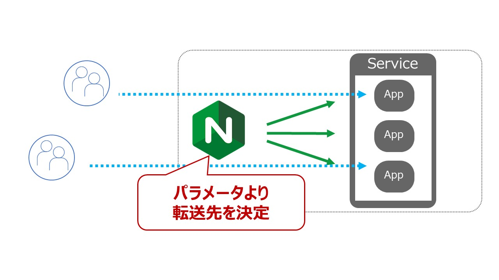

``ip_hash`` は 送信元IPアドレスを元に転送先を設定します

設定
~~~~

設定内容を確認します

.. code-block:: cmdin

  cat ~/f5j-nginx-plus-lab2-conf/lab/lb2-ip_hash.conf

.. code-block:: bash
  :caption: 実行結果サンプル
  :linenos:
  :emphasize-lines: 1-7

  upstream server_group {
      zone backend 64k;
      ip_hash;
  
      server backend1:81;
      server backend1:82;
  }
  
  server {
     listen 80;
     location / {
         proxy_pass http://server_group;
     }
  }

- 1-7行目が、ロードバランシングに該当する設定となります
- 3行目に ``ip_hash`` と記述しており、送信元IPアドレスに応じて転送先を決定する動作となります

設定を反映します

.. code-block:: cmdin

  sudo cp ~/f5j-nginx-plus-lab2-conf/lab/lb2-ip_hash.conf /etc/nginx/conf.d/default.conf
  sudo nginx -s reload

動作確認
~~~~

動作を確認します。

| ステータスを確認するためNGINX Plusのダッシュボードを開いてください。
| 画面上部 ``HTTP Upstreams`` のタブを選択してください。

以下のコマンドを実行し、動作を確認します。

.. code-block:: cmdin

  for i in {1..6}; do echo "==$i==" ; curl -s localhost/; echo""; sleep 1 ; done

.. code-block:: bash
  :caption: 実行結果サンプル
  :linenos:

  ==1==
  { "request_uri": "/","server_addr":"10.1.1.8","server_port":"81"}
  ==2==
  { "request_uri": "/","server_addr":"10.1.1.8","server_port":"81"}
  ==3==
  { "request_uri": "/","server_addr":"10.1.1.8","server_port":"81"}
  ==4==
  { "request_uri": "/","server_addr":"10.1.1.8","server_port":"81"}
  ==5==
  { "request_uri": "/","server_addr":"10.1.1.8","server_port":"81"}
  ==6==
  { "request_uri": "/","server_addr":"10.1.1.8","server_port":"81"}

リクエストを6回実行していますが、全て ``81`` が宛先となっていることが確認できます

NGINX Plus Dashboardの内容は以下のように表示されます

.. image:: ./media/nginx-lb2-ip_hash.jpg
   :width: 500

- ``Server`` の列に、ポート番号 ``81`` 、 ``82``  の2つが宛先として表示されています
- すべてポート番号 ``81`` の宛先に転送されており、 ``Requests`` の列を見ると ``6`` となっています

3. hash (request uri)
----

``hash`` は ``ip_hash`` と異なり、利用するパラメータを設定で指定することが可能です

設定
~~~~

設定内容を確認します

.. code-block:: cmdin

  cat ~/f5j-nginx-plus-lab2-conf/lab/lb3-hash.conf 

.. code-block:: bash
  :caption: 実行結果サンプル
  :linenos:
  :emphasize-lines: 1-7

  upstream server_group {
      zone backend 64k;
      hash $request_uri;
  
      server backend1:81;
      server backend1:82;
  }
  
  server {
     listen 80;
     location / {
         proxy_pass http://server_group;
     }
  }

- 1-7行目が、ロードバランシングに該当する設定となります
- 3行目に ``hash $request_uri`` と記述しており、先程 ``ip_hash`` の送信元IPアドレスではなく、 ``request URI`` に応じて宛先が決定されます

設定を反映します

.. code-block:: cmdin

  sudo cp ~/f5j-nginx-plus-lab2-conf/lab/lb3-hash.conf /etc/nginx/conf.d/default.conf
  sudo nginx -s reload

動作確認
~~~~

動作を確認します。

| ステータスを確認するためNGINX Plusのダッシュボードを開いてください。
| 画面上部 ``HTTP Upstreams`` のタブを選択してください。

| 以下のコマンドを実行し、動作を確認します。
| まず ``/path1`` 宛に通信を行います

.. code-block:: cmdin

  for i in {1..3}; do echo "==$i==" ; curl -s localhost/path1; echo""; sleep 1 ; done

.. code-block:: bash
  :caption: 実行結果サンプル
  :linenos:
  :emphasize-lines: 7

  ==1==
  { "request_uri": "/path1","server_addr":"10.1.1.8","server_port":"81"}
  ==2==
  { "request_uri": "/path1","server_addr":"10.1.1.8","server_port":"81"}
  ==3==
  { "request_uri": "/path1","server_addr":"10.1.1.8","server_port":"81"}

3回実行したリクエストが、全て ``81`` が宛先となっていることが確認できます

次に ``/path2`` 宛に通信を行います

.. code-block:: cmdin

  for i in {1..3}; do echo "==$i==" ; curl -s localhost/path2; echo""; sleep 1 ; done

.. code-block:: bash
  :caption: 実行結果サンプル
  :linenos:
  :emphasize-lines: 7

  ==1==
  { "request_uri": "/path2","server_addr":"10.1.1.8","server_port":"82"}
  ==2==
  { "request_uri": "/path2","server_addr":"10.1.1.8","server_port":"82"}
  ==3==
  { "request_uri": "/path2","server_addr":"10.1.1.8","server_port":"82"}

3回実行したリクエストが、全て ``82`` が宛先となっていることが確認できます

NGINX Plus Dashboardの内容は以下のように表示されます

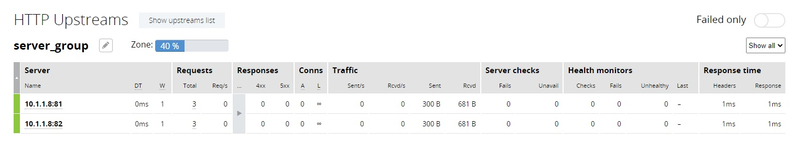

分散結果がコマンドの出力結果と一致することを確認してください

.. NOTE::
    ``/path1`` と ``/path2`` で結果に違いが見られなかった場合、自由にPATHを追加して通信結果を確認してください

4. least_time
----

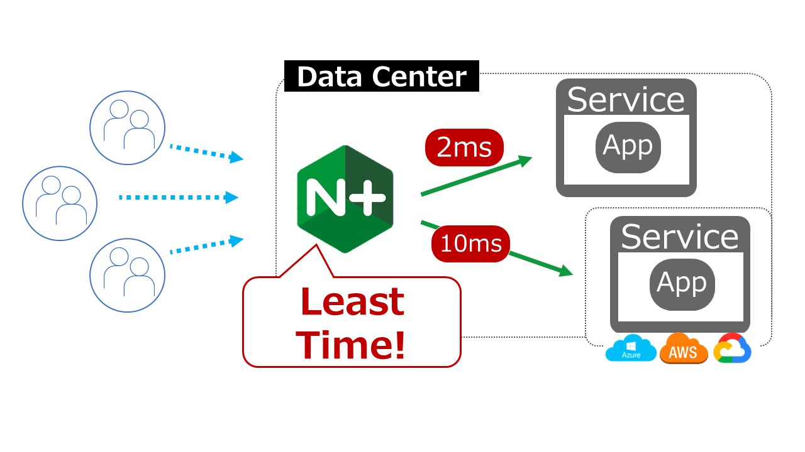

設定
~~~~

設定内容を確認します

.. code-block:: cmdin

  cat ~/f5j-nginx-plus-lab2-conf/lab/lb4-least_time.conf

.. code-block:: bash
  :caption: 実行結果サンプル
  :linenos:
  :emphasize-lines: 1-8

  upstream server_group {
      zone backend 64k;
      least_time header;
  
      server backend1:81;
      server backend1:82;
      server backend1:83;
  }
  
  server {
     listen 80;
     location / {
         proxy_pass http://server_group;
     }
  }

- 1-8行目が、ロードバランシングに該当する設定となります
- 3行目に ``least_time header`` と記述しており、アクセスした際に header の取得にかかった時間の短いホストにアクセスする設定となります

設定を反映します

.. code-block:: cmdin

  sudo cp ~/f5j-nginx-plus-lab2-conf/lab/lb4-least_time.conf /etc/nginx/conf.d/default.conf
  sudo nginx -s reload

動作確認
~~~~

動作を確認します。

| ステータスを確認するためNGINX Plusのダッシュボードを開いてください。
| 画面上部 ``HTTP Upstreams`` のタブを選択してください。

以下のコマンドを実行し、動作を確認します。

.. code-block:: cmdin

  for i in {1..6}; do echo "==$i==" ; curl -s localhost/; echo""; sleep 1 ; done

.. code-block:: bash
  :caption: 実行結果サンプル
  :linenos:

  ==1==
  { "request_uri": "/","server_addr":"10.1.1.8","server_port":"81"}
  ==2==
  { "request_uri": "/","server_addr":"10.1.1.8","server_port":"82"}
  ==3==
  { "request_uri": "/","server_addr":"10.1.1.8","server_port":"83"}
  ==4==
  { "request_uri": "/","server_addr":"10.1.1.8","server_port":"81"}
  ==5==
  { "request_uri": "/","server_addr":"10.1.1.8","server_port":"82"}
  ==6==
  { "request_uri": "/","server_addr":"10.1.1.8","server_port":"81"}

宛先が ``81`` > ``82`` > ``83`` となります。その後、 ``81`` > ``82`` > ``81`` となり、 ``83`` へ転送されていないことがわかります

NGINX Plus Dashboardの内容は以下のように表示されます

.. image:: ./media/nginx-lb4-least_time.jpg
   :width: 500

- ``Server`` の列に、ポート番号 ``81`` 、 ``82`` 、 ``83`` の3つが宛先として表示されています
- ``Requests`` の列を見ると、上から ``3`` 、 ``2`` 、 ``1`` となっています
- これは、分散方式として ``least_time header`` を選択しているため、初回はすべてのホストへ接続を転送しますが、 ``83`` のホストのHeader取得にかかる時間が ``Response time`` に示す通り 1秒程度 かかっています。このため、 ``83`` が除外され、 ``81`` 、 ``82`` へ優先して転送されます

4. アクティブヘルスチェック
====

アクティブヘルスチェックの設定を紹介します。

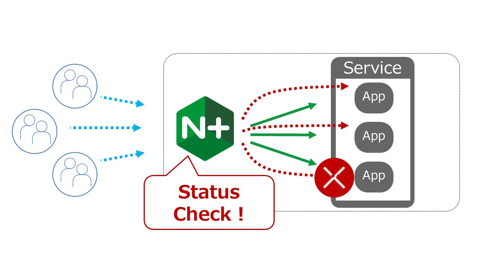

使用するディレクティブや設定の解説は以下のページを参照してください。

- HTTP match の詳細: `ngx_http_upstream_hc_module <http://nginx.org/en/docs/http/ngx_http_upstream_hc_module.html>`__ 
- HTTP Health Checks解説:  `HTTP Health Checks <https://docs.nginx.com/nginx/admin-guide/load-balancer/http-health-check/>`__

設定
----

設定内容を確認します

.. code-block:: cmdin

  cat ~/f5j-nginx-plus-lab2-conf/lab/active-healthcheck.conf

.. code-block:: bash
  :caption: 実行結果サンプル
  :linenos:
  :emphasize-lines: 10-13, 19

  upstream server_group {
      zone backend 64k;
  
      server backend1:81;
      server backend1:82;
      server backend1:83;
      server backend1:84;
  }
  
  match hc_rule {
      status 200;
      body ~ "echo";
  }
  
  server {
     listen 80;
     location / {
         proxy_pass http://server_group;
         health_check interval=5 fails=3 passes=2 uri=/echo match=hc_rule;
     }
  }

- 10-13行目で、Health Checkの条件を指定します。 ``status`` で期待するHTTP Responseコード、 ``body`` でBodyの内容に期待する文字列を指定します
- 19行目で、Health Check の実行間隔、 Unhealthy と判定されるまでの回数、復帰と判定される回数、 uri 、そして上部で指定したRuleを紐づけます

設定を反映します。

.. NOTE::

  この動作確認では設定反映後すぐにNGINX Plusのダッシュボードにて状態を確認します。
  可能であれば設定反映前にダッシュボードを開き、その後設定を反映してください。

.. code-block:: cmdin

  sudo cp ~/f5j-nginx-plus-lab2-conf/lab/active-healthcheck.conf /etc/nginx/conf.d/default.conf
  sudo nginx -s reload

動作確認
----

動作を確認します。

| ステータスを確認するためNGINX Plusのダッシュボードを開いてください。
| 画面上部 ``HTTP Upstreams`` のタブを選択してください。

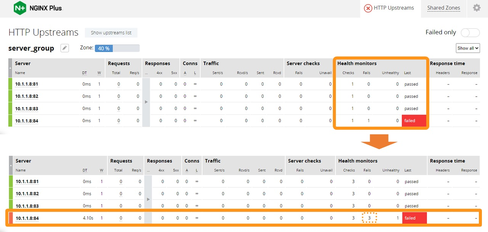

- 4つのホストが表示されていることがわかります
- Active Health Check が行われるため、 ``Health monitors`` の列が、通信を行っていない状態でもカウントアップすることが確認できます
- ポート番号 ``84`` のサーバでは、 Health Check が失敗し、 ``least`` の列が ``failed`` となります
- その後、 3回連続 ``failed`` となった後、 ``Unhealthy`` が ``1`` となり、該当サーバの左端が赤色となることが確認できます

なぜこのような結果となったのか確認します。

先程反映した設定の条件で ``/echo`` に対して通信を行い、HTTP Responseコードが ``200`` 、 Bodyに ``echo`` という文字列が期待されていました。

``backend1:81/echo`` の結果を確認します

.. code-block:: bash
  :caption: 実行結果サンプル
  :linenos:
  :emphasize-lines: 1,11,19

  $ curl -v backend1:81/echo
  *   Trying 10.1.1.8:81...
  * TCP_NODELAY set
  * Connected to backend1 (10.1.1.8) port 81 (#0)
  > GET /echo HTTP/1.1
  > Host: backend1:81
  > User-Agent: curl/7.68.0
  > Accept: */*
  >
  * Mark bundle as not supporting multiuse
  < HTTP/1.1 200 OK
  < Server: nginx/1.21.3
  < Date: Fri, 23 Sep 2022 10:52:15 GMT
  < Content-Type: application/octet-stream
  < Content-Length: 69
  < Connection: keep-alive
  <
  * Connection #0 to host backend1 left intact
  { "request_uri": "/echo","server_addr":"10.1.1.8","server_port":"81"}ubuntu@ip-10-1-1-7:~/f5j-nginx-plus-lab2-conf/lab$

- curlコマンドを実行した結果、 11行目の通り ``200 OK`` が応答されています
- 応答のBodyを確認すると、アクセスしたPATHの文字列が挿入されているため、19行目の通り ``request_uri`` に ``/echo`` という文字列が含まれています

``backend1:84/echo`` の結果を確認します

.. code-block:: bash
  :caption: 実行結果サンプル
  :linenos:
  :emphasize-lines: 1,11,19

  $ curl -v backend1:84/echo
  *   Trying 10.1.1.8:84...
  * TCP_NODELAY set
  * Connected to backend1 (10.1.1.8) port 84 (#0)
  > GET /echo HTTP/1.1
  > Host: backend1:84
  > User-Agent: curl/7.68.0
  > Accept: */*
  >
  * Mark bundle as not supporting multiuse
  < HTTP/1.1 500 Internal Server Error
  < Server: nginx/1.21.3
  < Date: Fri, 23 Sep 2022 10:52:50 GMT
  < Content-Type: application/octet-stream
  < Content-Length: 12
  < Connection: keep-alive
  <
  * Connection #0 to host backend1 left intact
  Server Error
  
- curlコマンドを実行した結果、 11行目の通り ``500 Internal Server Error`` が応答されています
- 応答のBodyを確認すると、19行目の通り ``Server Error`` であるため ``echo`` という文字列が含まれていません

Health Checkはこれらの文字列ステータスをもとに、サーバの状態を判定していることが確認できました

5. セッションパーシステンス
====

セッションパーシステンスの設定を紹介します。

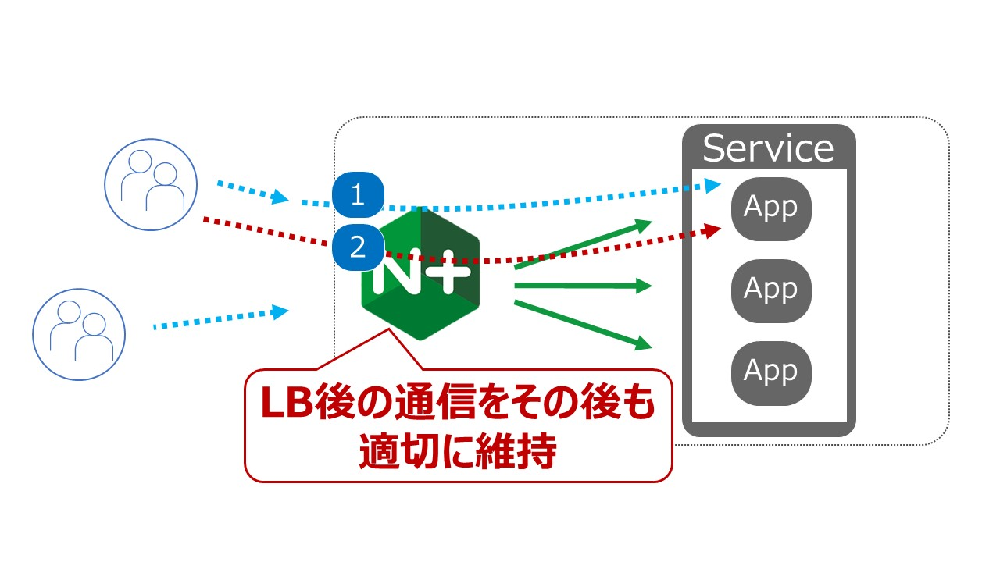

使用するディレクティブや設定の解説は以下のページを参照してください。

- HTTP Upstream Sticky の詳細: `ngx_http_upstream_module / sticky <http://nginx.org/en/docs/http/ngx_http_upstream_module.html#sticky>`__ 
- HTTP Load Balancing解説:  `Enabling Session Persistence <https://docs.nginx.com/nginx/admin-guide/load-balancer/http-load-balancer/#enabling-session-persistence>`__

1. sticky cookie
----

設定
~~~~

設定内容を確認します

.. code-block:: cmdin

  cat ~/f5j-nginx-plus-lab2-conf/lab/session-persistence1-cookie.conf

.. code-block:: bash
  :caption: 実行結果サンプル
  :linenos:
  :emphasize-lines: 3

  upstream server_group {
      zone backend 64k;
      sticky cookie srv_id expires=1h domain=.example.com path=/;
  
      server backend1:81;
      server backend1:82;
  }
  
  server {
     listen 80;
     location / {
         proxy_pass http://server_group;
     }
  }

- 1-8行目が、ロードバランシングに該当する設定となります
- 3行目に ``sticky cookie`` と記述しており、Cookie を用いたセッションパーシステンスを実施します

設定を反映します

.. code-block:: cmdin

  sudo cp ~/f5j-nginx-plus-lab2-conf/lab/session-persistence1-cookie.conf /etc/nginx/conf.d/default.conf
  sudo nginx -s reload

動作確認
~~~~

以下のコマンドを実行し、動作を確認します。

.. code-block:: cmdin

  curl -v localhost

.. code-block:: bash
  :caption: 実行結果サンプル
  :linenos:
  :emphasize-lines: 16,19

  *   Trying 127.0.0.1:80...
  * TCP_NODELAY set
  * Connected to localhost (127.0.0.1) port 80 (#0)
  > GET / HTTP/1.1
  > Host: localhost
  > User-Agent: curl/7.68.0
  > Accept: */*
  >
  * Mark bundle as not supporting multiuse
  < HTTP/1.1 200 OK
  < Server: nginx/1.21.6
  < Date: Fri, 23 Sep 2022 06:46:16 GMT
  < Content-Type: application/octet-stream
  < Content-Length: 65
  < Connection: keep-alive
  < Set-Cookie: srv_id=d90714beec1b83b75b3817079340fb00; expires=Fri, 23-Sep-22 07:46:16 GMT; max-age=3600; domain=.example.com; path=/
  <
  * Connection #0 to host localhost left intact
  { "request_uri": "/","server_addr":"10.1.1.8","server_port":"81"}

- 16行目に、NGINXより Cookie が応答されていることを確認してください。 ``srv_id`` の値がSticky Sessionに利用されるCookieの値となります。その他の値は設定で示した内容と同様であることことが確認できます
- 19行目の内容より、この実行結果では、 ``server_port`` が ``81`` に転送されていることがわかります。

以下のように、curlコマンドで、 ``srv_id`` の内容を HTTP Header に指定しリクエストを送付してください

.. code-block:: cmdin

  # curl -v localhost -H "Cookie: srv_id=<初回アクセス時に取得したsrv_idの値>"
  curl -v localhost -H "Cookie: srv_id=d90714beec1b83b75b3817079340fb00"

.. code-block:: bash
  :caption: 実行結果サンプル
  :linenos:
  :emphasize-lines: 8

  *   Trying 127.0.0.1:80...
  * TCP_NODELAY set
  * Connected to localhost (127.0.0.1) port 80 (#0)
  > GET / HTTP/1.1
  > Host: localhost
  > User-Agent: curl/7.68.0
  > Accept: */*
  > Cookie: srv_id=d90714beec1b83b75b3817079340fb00
  >
  * Mark bundle as not supporting multiuse
  < HTTP/1.1 200 OK
  < Server: nginx/1.21.6
  < Date: Fri, 23 Sep 2022 06:46:41 GMT
  < Content-Type: application/octet-stream
  < Content-Length: 65
  < Connection: keep-alive
  < Set-Cookie: srv_id=d90714beec1b83b75b3817079340fb00; expires=Fri, 23-Sep-22 07:46:41 GMT; max-age=3600; domain=.example.com; path=/
  <
  * Connection #0 to host localhost left intact
  { "request_uri": "/","server_addr":"10.1.1.8","server_port":"81"}

先程と同様のホストにアクセスしていることが確認できます。その後複数回実行いただいた場合にも同様の結果となることが確認いただけます。

2. route
----

Sticky Route はUpstreamのサーバに対し予め route を設定し、リクエストの情報の一部から取得した route 情報を元に転送先を決定する手法となります

設定
~~~~

設定内容を確認します

.. code-block:: cmdin

  cat ~/f5j-nginx-plus-lab2-conf/lab/session-persistence2-route.conf

.. code-block:: bash
  :caption: 実行結果サンプル
  :linenos:
  :emphasize-lines: 1-3,5-7,9-11,15,17-18,23

  log_format session_info '$remote_addr - $remote_user [$time_local] "$request" '
                 '$status $body_bytes_sent "$http_referer" "$http_user_agent" '
                 'Cookie $route_cookie URIrouteid $route_uri URIflag $arg_flag';

  map $cookie_routeid $route_cookie {
      ~.+\.(?P<route>\w+)$ $route;
  }

  map $request_uri $route_uri {
      ~routeid=.+\.(?P<route>\w+)$ $route;
  }

  upstream server_group {
      zone backend 64k;
      sticky route $route_cookie $route_uri $arg_flag;

      server backend1:81 route=a;
      server backend1:82 route=b;
  }

  server {
     access_log /var/log/nginx/access.log session_info;
     listen 80;
     location / {
         proxy_pass http://server_group;
     }
  }

- 15行目および17-18行目が ``sticky route`` に関する設定となります。17-18行目の末尾に ``route=`` で示した内容が入力された場合にそれぞれのサーバに転送されます。そのrouteとして判定する条件が15行目の内容であり、左側から優先度が高くなり、設定例では、 ``$route_cookie`` 、 ``$route_uri`` 、 ``$arg_flag`` を指定しています
- 5-7行目が、cookieの値を正規表現で評価し、``$route_cookie`` に対して正規表現から取得した ``$route`` の値を格納するための map directive で、 Request URIの内容に対し同様の処理を行う箇所が9-11行目となります
- 1-3行目、23行目はこれらの値の結果を確認するために指定したAccess Logに関する設定です

設定を反映します

.. code-block:: cmdin

  sudo cp ~/f5j-nginx-plus-lab2-conf/lab/session-persistence2-route.conf /etc/nginx/conf.d/default.conf
  sudo nginx -s reload

動作確認
~~~~

複数のパラメータを指定し動作を確認します

+------+--------------+---------------+
|優先度|種類          | 値            |
+======+==============+===============+
|1     |Cookie        | routeid=val.b |
+------+--------------+---------------+
|2     |URLパラメータ | routeid=val.a |
+------+--------------+---------------+
|3     |URLパラメータ | flag=a        |
+------+--------------+---------------+

- 設定の解説で確認した通り、表のような優先度で評価されます
- Cookieの ``routeid`` の値、 ``.(ドット)`` の右側の値が ``route`` の判定で利用されます
- URLパラメータの ``routeid`` の値、 ``.(ドット)`` の右側の値が ``route`` の判定で利用されます
- URLパラメータの ``flag`` の値が ``route`` の判定で利用されます

リクエストを送信します

.. code-block:: cmdin

  curl "localhost/?flag=a&routeid=val.a" -H "Cookie: routeid=val.b"

.. code-block:: bash
  :caption: 実行結果サンプル
  :linenos:

  { "request_uri": "/?flag=a&routeid=val.a","server_addr":"10.1.1.8","server_port":"82"}

``route`` の値が ``b`` である、 ``server_port`` が ``82`` server からの応答であることが確認できます。Cookie の値に従って応答返されていることが確認できます

URLパラメータのみを指定したリクエストを送信します

.. code-block:: cmdin

  curl "localhost/?flag=a&routeid=val.b"

.. code-block:: bash
  :caption: 実行結果サンプル
  :linenos:

  { "request_uri": "/?flag=a&routeid=val.b","server_addr":"10.1.1.8","server_port":"82"}

``route`` の値が ``b`` である ``server_port`` が ``82`` からの応答であることが確認できます。URLパラメータの ``routeid`` の値が適切に処理され応答が返されていることが確認できます

``flag`` のURLパラメータを指定したリクエストを送信します

.. code-block:: cmdin

  curl "localhost/?flag=b"
  
.. code-block:: bash
  :caption: 実行結果サンプル
  :linenos:

  { "request_uri": "/?flag=b","server_addr":"10.1.1.8","server_port":"82"}

``route`` の値が ``b`` である ``server_port`` が ``82`` からの応答であることが確認できます。URLパラメータの ``flag`` の値が適切に処理され応答が返されていることが確認できます

どのように通信を行っているのか確認するため、ログの内容を確認します

.. code-block:: cmdin

  tail -3 /var/log/nginx/access.log

.. code-block:: bash
  :caption: 実行結果サンプル
  :linenos:

  127.0.0.1 - - [07/Oct/2022:13:52:53 +0900] "GET /?flag=a&routeid=val.a HTTP/1.1" 200 86 "-" "curl/7.68.0" Cookie b URIrouteid a URIflag a
  127.0.0.1 - - [07/Oct/2022:13:53:35 +0900] "GET /?flag=a&routeid=val.b HTTP/1.1" 200 86 "-" "curl/7.68.0" Cookie  URIrouteid b URIflag a
  127.0.0.1 - - [07/Oct/2022:13:53:57 +0900] "GET /?flag=b HTTP/1.1" 200 72 "-" "curl/7.68.0" Cookie  URIrouteid  URIflag b

- 1行目は、1回目のリクエストの結果を示し ``Cookie`` の判定結果が ``b`` 、 ``URLのrouteid`` が ``a`` 、 ``URIのflag`` が ``a`` であることがわかります
- 2行目は、2回目のリクエストの結果を示し ``URLのrouteid`` が ``b`` 、 ``URIのflag`` が ``a`` であることがわかります
- 3行目は、3回目のリクエストの結果を示し ``URIのflag`` が ``b`` であることがわかります

それぞれ指定した値に応じて結果が出力されていたことが確認できます

3. learn
----

Sticky LearnはNGINXがProxyする際にクライアントへ応答されるレスポンスに含まれるCookieの名称を指定、その値を取得し、以降その値に応じて通信維持を行う手法です

設定
~~~~

設定内容を確認します

.. code-block:: cmdin

  cat ~/f5j-nginx-plus-lab2-conf/lab/session-persistence3-learn.conf

.. code-block:: bash
  :caption: 実行結果サンプル
  :linenos:
  :emphasize-lines: 1-3,8-11,31,28,36

  log_format session_info '$remote_addr - $remote_user [$time_local] "$request" '
                 '$status $body_bytes_sent "$http_referer" "$http_user_agent" '
                 'upstream $proxy_host $proxy_port server $upstream_addr';

  upstream server_sticky_learn {
      zone backend 64k;
      sticky learn
             create=$upstream_cookie_srv-id
             lookup=$cookie_srv-id
             zone=sticky_learn:1m;

      server localhost:8081;
      server localhost:8082;
  }

  upstream server_group {
      zone backend 64k;
      sticky cookie srv-id expires=1h domain=.example.com path=/;

      server backend1:81;
      server backend1:82;
  }

  server {
     access_log /var/log/nginx/access.log session_info;
     listen 80;
     location / {
         proxy_pass http://server_sticky_learn;
     }
  }

  server {
     access_log /var/log/nginx/access.log session_info;
     listen 8081;
     listen 8082;
     location / {
         proxy_pass http://server_group;
     }
  }

- 8-11行目が、``sticky learn`` の設定となります

  - ``create`` : sticky session を生成するための条件となる、upstream(分散先)から応答されたCookieの値を指定します。この例では ``srv-id`` というCookieの値が取得されます
  - ``lookup`` : 2回目以降のリクエストで通信維持の判定を行うための ``Cookieの名称`` を指定します。この例では ``srv-id`` というCookieが提示される想定となります
  - ``zone``   : sticky learn の セッション情報を保持するZoneを指定します。1m(1 Mbyte)の場合、64bit のプラットフォームであれば約4000のエントリを保持できます

- 31行目で、 ``sticky learn`` を設定したupstream ``server_sticky_learn`` に従って転送します。この宛先はNGINX自身がListenする 8081, 8082 となります
- 8081 , 8082 を指定するserver directiveはupstream ``server_group`` に従って転送します。このUpstreamでは ``sticky cookie`` を設定しているためレスポンスに ``srv-id`` という名称の ``set-cookie`` を返します

設定を反映します

.. code-block:: cmdin

  sudo cp ~/f5j-nginx-plus-lab2-conf/lab/session-persistence3-learn.conf /etc/nginx/conf.d/default.conf
  sudo nginx -s reload

動作確認
~~~~

以下のコマンドを実行し、動作を確認します。

.. code-block:: cmdin

  curl -v localhost

.. code-block:: bash
  :caption: 実行結果サンプル
  :linenos:
  :emphasize-lines: 16,19

  *   Trying 127.0.0.1:80...
  * TCP_NODELAY set
  * Connected to localhost (127.0.0.1) port 80 (#0)
  > GET / HTTP/1.1
  > Host: localhost
  > User-Agent: curl/7.68.0
  > Accept: */*
  >
  * Mark bundle as not supporting multiuse
  < HTTP/1.1 200 OK
  < Server: nginx/1.21.6
  < Date: Fri, 07 Oct 2022 03:45:26 GMT
  < Content-Type: application/octet-stream
  < Content-Length: 65
  < Connection: keep-alive
  < Set-Cookie: srv-id=d90714beec1b83b75b3817079340fb00; expires=Fri, 07-Oct-22 04:45:26 GMT; max-age=3600; domain=.example.com; path=/
  <
  * Connection #0 to host localhost left intact
  { "request_uri": "/","server_addr":"10.1.1.8","server_port":"81"}

- 16行目に、NGINXより Cookie が応答されていることを確認してください。 ``srv_id`` の値がSticky Sessionに利用されるCookieの値となります。この値は ``server_group`` のUpstreamの設定に応じて動作した結果となります
- 19行目の内容より、この実行結果では、 ``server_port`` が ``81`` に転送されていることがわかります。

以下のように、curlコマンドで、 ``srv_id`` の内容を HTTP Header に指定しリクエストを送付してください

.. code-block:: cmdin

  # curl -v localhost -H "Cookie: srv_id=<初回アクセス時に取得したsrv_idの値>"
  curl -v localhost -H "Cookie: srv-id=d90714beec1b83b75b3817079340fb00"

.. code-block:: bash
  :caption: 実行結果サンプル
  :linenos:
  :emphasize-lines: 8

  
  *   Trying 127.0.0.1:80...
  * TCP_NODELAY set
  * Connected to localhost (127.0.0.1) port 80 (#0)
  > GET / HTTP/1.1
  > Host: localhost
  > User-Agent: curl/7.68.0
  > Accept: */*
  > Cookie: srv-id=d90714beec1b83b75b3817079340fb00
  >
  * Mark bundle as not supporting multiuse
  < HTTP/1.1 200 OK
  < Server: nginx/1.21.6
  < Date: Fri, 07 Oct 2022 03:45:47 GMT
  < Content-Type: application/octet-stream
  < Content-Length: 65
  < Connection: keep-alive
  < Set-Cookie: srv-id=d90714beec1b83b75b3817079340fb00; expires=Fri, 07-Oct-22 04:45:47 GMT; max-age=3600; domain=.example.com; path=/
  <
  * Connection #0 to host localhost left intact
  { "request_uri": "/","server_addr":"10.1.1.8","server_port":"81"}

先程と同様のホストにアクセスしていることが確認できます。その後複数回実行いただいた場合にも同様の結果となることが確認いただけます。

どのように通信を行っているのか確認するため、ログの内容を確認します

.. code-block:: cmdin

  tail -4 /var/log/nginx/access.log

.. code-block:: bash
  :caption: 実行結果サンプル
  :linenos:
  :emphasize-lines: 8

  127.0.0.1 - - [07/Oct/2022:12:45:26 +0900] "GET / HTTP/1.0" 200 65 "-" "curl/7.68.0" upstream server_group 80 server 10.1.1.8:81
  127.0.0.1 - - [07/Oct/2022:12:45:26 +0900] "GET / HTTP/1.1" 200 65 "-" "curl/7.68.0" upstream server_sticky_learn 80 server 127.0.0.1:8081
  127.0.0.1 - - [07/Oct/2022:12:45:47 +0900] "GET / HTTP/1.0" 200 65 "-" "curl/7.68.0" upstream server_group 80 server 10.1.1.8:81
  127.0.0.1 - - [07/Oct/2022:12:45:47 +0900] "GET / HTTP/1.1" 200 65 "-" "curl/7.68.0" upstream server_sticky_learn 80 server 127.0.0.1:8081

- ``upstream`` 、 ``server`` の値を確認します
- 1-2行目が1回目の curl 、 3-4 行目が2回目の curl となります
- 1行目は ``server_group`` の ``10.1.1.8:81`` の応答がなされた結果を示します
- 2行目は sticky learn を設定したupstream ``server_sticky_learn`` の ``127.0.0.1:8081`` の応答がなされた結果を示します
- 3行目の curl は1行目の同様と結果、4行目の curl は2行目と同様の結果になっています
- 3行目は server_group に設定した sticky cookie によりセッションが維持されており、 ``srv-id`` を応答しています
- 4行目は server_sticky_learn に設定した sticky learn が ``srv-id`` の内容を取得し、以降の通信では ``srv-id`` の内容に応じて通信を転送していることがわかります

以降、同じCookieを指定し実行した場合、同様の結果となることが確認いただけます

6. サービスディスカバリ
====

サービスディスカバリの設定を紹介します。

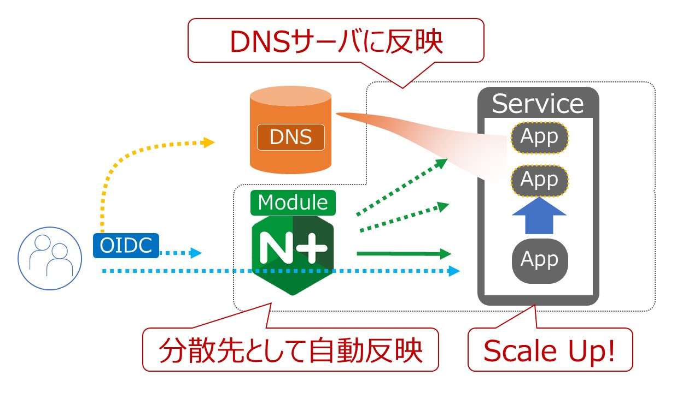

使用するディレクティブや設定の解説は以下のページを参照してください。

- HTTP Core Resolver の詳細: `ngx_http_core_module / resolver <http://nginx.org/en/docs/http/ngx_http_core_module.html#resolver>`__ 
- HTTP Load Balancing解説:  `Configuring HTTP Load Balancing Using DNS <https://docs.nginx.com/nginx/admin-guide/load-balancer/http-load-balancer/#configuring-http-load-balancing-using-dns>`__

設定
----

DNSによる名前解決を行い、サービスディスカバリを行います。

設定内容を確認します。

.. code-block:: cmdin

  cat ~/f5j-nginx-plus-lab2-conf/lab/service-discovery.conf

.. code-block:: bash
  :caption: 実行結果サンプル
  :linenos:
  :emphasize-lines: 1-2,7

  resolver 10.1.1.5 valid=10s ipv6=off;
  resolver_timeout 10s;
  
  upstream server_group {
      zone backend 64k;
  
      server api1:80 resolve;
  }
  
  server {
      listen 80;
      location / {
          proxy_pass http://server_group;
      }
  }

- 1-2行目で、NGINX が名前解決を行う際に利用するDNSサーバの情報を指定します
- 7行目、Upstream内のサーバに対し、名前解決を実施するため、末尾に ``resolve`` を指定します。こちらを指定することにより ``api1`` という名称を指定のDNSサーバで解決し、その結果をUpstreamのサーバとして登録します

設定を反映します

.. code-block:: cmdin

  sudo cp ~/f5j-nginx-plus-lab2-conf/lab/service-discovery.conf /etc/nginx/conf.d/default.conf
  sudo nginx -s reload

動作確認
----

- DNSサーバで解決した結果を確認

| ステータスを確認するためNGINX Plusのダッシュボードを開いてください。
| 画面上部 ``HTTP Upstreams`` のタブを選択してください。

NGINXのresolver設定で指定したDNSサーバで名前を解決し、サーバを表示していることが確認できます。
``api1`` の名前を解決した結果、ホストが4つ表示されることを確認してください。

NGINX Plus Dashboardの内容は以下のように表示されます

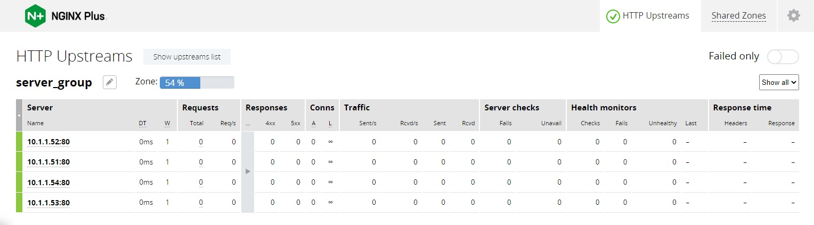

- DNSサーバで応答する内容の変更

DNSサーバの応答を変更するため、 ``docker_host`` へログインします

Windows Jump Hostへログインいただくと、SSHClientのショートカットがありますので、
そちらの ``docker_host`` をクリックし、接続してください。

   - .. image:: ../module01/media/putty_icon.jpg
      :width: 50

   - .. image:: ../module01/media/putty_menu.jpg
      :width: 200

``docker_host`` で以下コマンドを実行しファイルを取得します。

.. code-block:: cmdin

  cd ~/
  git clone https://github.com/BeF5/f5j-nginx-plus-lab2-conf

以下コマンドを実行し、DNSサーバの設定ファイルを読み込みます。

.. code-block:: cmdin

  cd ~/f5j-nginx-plus-lab2-conf/docker-compose/dnsmasq/
  docker-compose -f dnsmasq-docker-compose2.yaml up -d

.. code-block:: bash
  :caption: 実行結果サンプル
  :linenos:

  Recreating dnsmasq_dns_1 ... done

NGINXのDNSを利用したサービスディスカバリの結果、 ``api1`` で指定したホストが2つに変化することを確認してください。

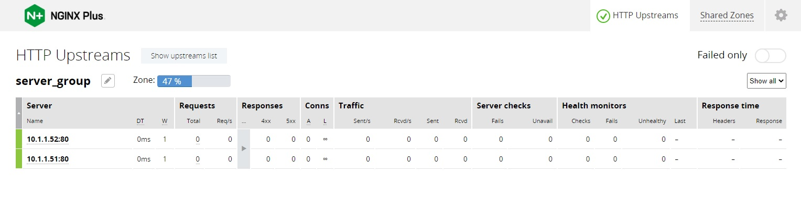

``docker_host`` で以下コマンドを実行すると、 ``api1`` として元の4つのホストが表示されます

.. code-block:: cmdin

  cd ~/f5j-nginx-plus-lab2-conf/docker-compose/dnsmasq/
  docker-compose -f dnsmasq-docker-compose1.yaml up -d

.. code-block:: bash
  :caption: 実行結果サンプル
  :linenos:

  Recreating dnsmasq_dns_1 ... done

