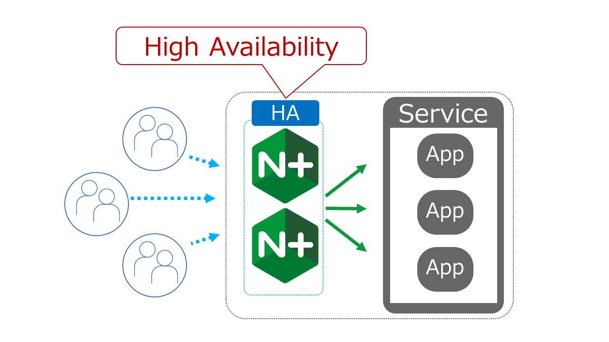
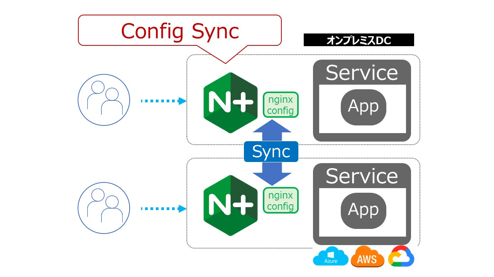

NGINX Plus 冗長構成
####

0. 事前作業
====

NGINX Install
----

冗長構成とするため、 ``ubuntu02`` に対しNGINXをインストールします。

Windows Jump Hostへログインいただくと、SSHClientのショートカットがありますので、そちらをダブルクリックし
``ubuntu02`` へ接続ください

   - .. image:: ../module01/media/putty_icon.jpg
      :width: 50

   - .. image:: ../module01/media/putty_menu.jpg
      :width: 200

| 以下のページの内容を参考にNGINX Plus及びモジュールをインストールします
| `NGINX Plus Lab 1. NGINX Plusのインストール (15min) <https://f5j-nginx-plus-lab1.readthedocs.io/en/latest/class1/module2/module2.html#nginx-plus-15min>`__

1. 冗長構成
====

詳細は以下のページを参照してください

- `High Availability Support for NGINX Plus in On-Premises Deployments <https://docs.nginx.com/nginx/admin-guide/high-availability/ha-keepalived/>`__

モジュールのインストール
----

``ubuntu01`` 、 ``ubuntu02`` の双方で以下のモジュールをインストールしてください

.. code-block:: cmdin

  sudo apt-get install nginx-ha-keepalived  nginx-sync

インストール結果を確認してください

.. code-block:: cmdin

  dpkg-query -l | grep -e nginx-ha-keepalived -e nginx-sync

.. code-block:: bash
  :caption: 実行結果サンプル
  :linenos:

  ii  nginx-ha-keepalived                2.2.7-4~focal                         amd64        Tools for creating and managing NGINX Plus HA cluster
  ii  nginx-sync                         1.1                                   all          nginx configs synchronization script

スクリプトを用いた初期設定
----

双方のホストで ``nginx-ha-setup`` コマンドを利用しセットアップを行います。実行するホストに注意してください

``ubuntu01`` で以下の内容を実行してください。 ``MASTER`` としてセットアップします

.. code-block:: cmdin

  sudo nginx-ha-setup

.. code-block:: bash
  :caption: 実行結果サンプル
  :linenos:
  :emphasize-lines: 16,24,28,30,33,41,43,53,61

  Thank you for using NGINX Plus!
  
  This script is intended for use with RHEL/CentOS/SLES/Debian/Ubuntu-based systems.
  It will configure highly available NGINX Plus environment in Active/Passive pair.
  
  NOTE: you will need the following in order to continue:
   - 2 running systems (nodes) with static IP addresses
   - one free IP address to use as Cluster IP endpoint
  
  It is strongly recommended to run this script simultaneously on both nodes,
  e.g. use two terminal windows and switch between them step by step.
  
  It is recommended to run this script under screen(1) in order to allow
  installation process to continue in case of unexpected session disconnect.
  
  Press <Enter> to continue...  << ENTER を入力
  
  Step 1: configuring internal management IP addresses.
  
  In order to communicate with each other, both nodes must have at least one IP address.
  
  The guessed primary IP of this node is: 10.1.1.7/24  
  
  Do you want to use this address for internal cluster communication? (y/n)  << y を入力
  IP address of this host is set to: 10.1.1.7/24
  Primary network interface: ens5
  
  Now please enter IP address of a second node: 10.1.1.6  << 10.1.1.6(対向のNGINX) を入力
  You entered: 10.1.1.6
  Is it correct? (y/n)  << y を入力
  IP address of the second node is set to: 10.1.1.6
  
  Press <Enter> to continue...  << ENTER を入力
  
  Step 2: creating keepalived configuration
  
  Now you have to choose cluster IP address.
  This address will be used as en entry point to all your cluster resources.
  The chosen address must not be one already associated with a physical node.
  
  Enter cluster IP address: 10.1.1.100  << 10.1.1.100(HA IP) を入力
  You entered: 10.1.1.100
  Is it correct? (y/n) << y を入力
  
  You must choose which node should have the MASTER role in this cluster.
  
  Please choose what the current node role is:
  1) MASTER
  2) BACKUP
  
  (on the second node you should choose the opposite variant)
  
  Press 1 or 2.  << 1(MASTER) を入力
  This is the MASTER node.
  
  Step 3: starting keepalived
  
  Starting keepalived...
  keepalived has been successfully started.
  
  Press <Enter> to continue... << ENTER を入力
  
  Step 4: configuring cluster
  
  Enabling keepalived and nginx at boot time...
  Initial configuration complete!
  
  keepalived logs are written to syslog and located here:
  /var/log/syslog
  
  Further configuration may be required according to your needs
  and environment.
  Main configuration file for keepalived can be found at:
   /etc/keepalived/keepalived.conf
  
  To control keepalived, use 'service keepalived' command:
   service keepalived status
  
  keepalived documentation can be found at:
  http://www.keepalived.org/
  
  NGINX-HA-keepalived documentation can be found at:
  /usr/share/doc/nginx-ha-keepalived/README
  
  Thank you for using NGINX Plus!

``ubuntu02`` で以下の内容を実行してください。 ``MASTER`` としてセットアップします

.. code-block:: cmdin

  sudo nginx-ha-setup

.. code-block:: bash
  :caption: 実行結果サンプル
  :linenos:
  :emphasize-lines: 16,24,28,30,33,41,43,53,61

  Thank you for using NGINX Plus!
  
  This script is intended for use with RHEL/CentOS/SLES/Debian/Ubuntu-based systems.
  It will configure highly available NGINX Plus environment in Active/Passive pair.
  
  NOTE: you will need the following in order to continue:
   - 2 running systems (nodes) with static IP addresses
   - one free IP address to use as Cluster IP endpoint
  
  It is strongly recommended to run this script simultaneously on both nodes,
  e.g. use two terminal windows and switch between them step by step.
  
  It is recommended to run this script under screen(1) in order to allow
  installation process to continue in case of unexpected session disconnect.
  
  Press <Enter> to continue...  << ENTER を入力
  
  Step 1: configuring internal management IP addresses.
  
  In order to communicate with each other, both nodes must have at least one IP address.
  
  The guessed primary IP of this node is: 10.1.1.6/24
  
  Do you want to use this address for internal cluster communication? (y/n)  << y を入力
  IP address of this host is set to: 10.1.1.6/24
  Primary network interface: ens5
  
  Now please enter IP address of a second node: 10.1.1.7  << 10.1.1.7(対向のNGINX) を入力
  You entered: 10.1.1.7
  Is it correct? (y/n)  << y を入力
  IP address of the second node is set to: 10.1.1.7
  
  Press <Enter> to continue...  << ENTER を入力
  
  Step 2: creating keepalived configuration
  
  Now you have to choose cluster IP address.
  This address will be used as en entry point to all your cluster resources.
  The chosen address must not be one already associated with a physical node.
  
  Enter cluster IP address: 10.1.1.100  << 10.1.1.100(HA IP) を入力
  You entered: 10.1.1.100
  Is it correct? (y/n) << y を入力
  
  You must choose which node should have the MASTER role in this cluster.
  
  Please choose what the current node role is:
  1) MASTER
  2) BACKUP
  
  (on the second node you should choose the opposite variant)
  
  Press 1 or 2.  << 2(BACKUP) を入力
  This is the BACKUP node.
  
  Step 3: starting keepalived
  
  Starting keepalived...
  keepalived has been successfully started.
  
  Press <Enter> to continue... << ENTER を入力
  
  Step 4: configuring cluster
  
  Enabling keepalived and nginx at boot time...
  Initial configuration complete!
  
  keepalived logs are written to syslog and located here:
  /var/log/syslog
  
  Further configuration may be required according to your needs
  and environment.
  Main configuration file for keepalived can be found at:
   /etc/keepalived/keepalived.conf
  
  To control keepalived, use 'service keepalived' command:
   service keepalived status
  
  keepalived documentation can be found at:
  http://www.keepalived.org/
  
  NGINX-HA-keepalived documentation can be found at:
  /usr/share/doc/nginx-ha-keepalived/README
  
  Thank you for using NGINX Plus!

確認
----

keepalived の 設定ファイルの内容を確認します。双方のホストで実行した結果を確認します

.. code-block:: cmdin

  cat /etc/keepalived/keepalived.conf

.. code-block:: bash
  :caption: 実行結果サンプル
  :linenos:
  :emphasize-lines: 19,20,26,28,31

  ## ubuntu01 の出力結果
  global_defs {
          vrrp_version 3
  }
  
  vrrp_script chk_manual_failover {
          script "/usr/lib/keepalived/nginx-ha-manual-failover"
          interval 10
          weight 50
  }
  
  vrrp_script chk_nginx_service {
          script "/usr/lib/keepalived/nginx-ha-check"
          interval 3
          weight 50
  }
  
  vrrp_instance VI_1 {
          interface ens5
          priority 101
          virtual_router_id 51
          advert_int 1
          accept
          garp_master_refresh 5
          garp_master_refresh_repeat 1
          unicast_src_ip 10.1.1.7/24
          unicast_peer {
                  10.1.1.6
          }
          virtual_ipaddress {
                  10.1.1.100
          }
          track_script {
                  chk_nginx_service
                  chk_manual_failover
          }
          notify "/usr/lib/keepalived/nginx-ha-notify"
  }

- 18-38行目が、冗長構成の主要な設定となります
- 19行目が、VRRPで利用するインタフェースです
- 20行目が、Priorityを指定し ``MASTER`` は ``101`` となります
- 26行目が自ホストのIPアドレス、28行目が対向ホストのIPアドレス、31行目が冗長構成で利用する ``VIrtual IP(VIP)`` となります

.. code-block:: bash
  :caption: 実行結果サンプル
  :linenos:
  :emphasize-lines: 19,20,26,28,31

  ## ubuntu02 の出力結果
  global_defs {
          vrrp_version 3
  }
  
  vrrp_script chk_manual_failover {
          script "/usr/lib/keepalived/nginx-ha-manual-failover"
          interval 10
          weight 50
  }
  
  vrrp_script chk_nginx_service {
          script "/usr/lib/keepalived/nginx-ha-check"
          interval 3
          weight 50
  }
  
  vrrp_instance VI_1 {
          interface ens5
          priority 100
          virtual_router_id 51
          advert_int 1
          accept
          garp_master_refresh 5
          garp_master_refresh_repeat 1
          unicast_src_ip 10.1.1.6/24
          unicast_peer {
                  10.1.1.7
          }
          virtual_ipaddress {
                  10.1.1.100
          }
          track_script {
                  chk_nginx_service
                  chk_manual_failover
          }
          notify "/usr/lib/keepalived/nginx-ha-notify"
  }

- 18-38行目が、冗長構成の主要な設定となり、基本的な記述は ``ubuntu01(MASTER)`` となります
- 20行目が、Priorityを指定し ``BACKUP`` は ``100`` となります

冗長構成のStateを確認します。双方のホストで実行した結果を確認します

.. code-block:: cmdin

  cat /var/run/nginx-ha-keepalived.state

.. code-block:: bash
  :caption: 実行結果サンプル
  :linenos:

  ## ubuntu01 の出力結果
  STATE=MASTER

  ## ubuntu02 の出力結果
  STATE=BACKUP

出力結果よりホストのステータスが確認できます

セットアップ後のインタフェースを確認します。双方のホストで実行した結果を確認します

.. code-block:: cmdin

  ip addr show ens5

.. code-block:: bash
  :caption: 実行結果サンプル
  :linenos:
  :emphasize-lines: 7-8

  ## ubuntu01 の出力結果
  2: ens5: <BROADCAST,MULTICAST,UP,LOWER_UP> mtu 9001 qdisc mq state UP group default qlen 1000
      link/ether 06:b4:8c:4d:47:0d brd ff:ff:ff:ff:ff:ff
      altname enp0s5
      inet 10.1.1.7/24 brd 10.1.1.255 scope global dynamic ens5
         valid_lft 2830sec preferred_lft 2830sec
      inet 10.1.1.100/32 scope global ens5
         valid_lft forever preferred_lft forever
      inet6 fe80::4b4:8cff:fe4d:470d/64 scope link
         valid_lft forever preferred_lft forever
  
  ## ubuntu02 の出力結果
  2: ens5: <BROADCAST,MULTICAST,UP,LOWER_UP> mtu 9001 qdisc mq state UP group default qlen 1000
      link/ether 06:f7:7d:74:47:55 brd ff:ff:ff:ff:ff:ff
      inet 10.1.1.6/24 brd 10.1.1.255 scope global dynamic ens5
         valid_lft 2750sec preferred_lft 2750sec
      inet6 fe80::4f7:7dff:fe74:4755/64 scope link
         valid_lft forever preferred_lft forever

- 各ホストのインタフェースが確認できます
- ``MASTER`` である ``ubuntu01`` の結果を確認すると、7-8行目に ``VIP`` が割り当てられることが確認できます

VRRPにより、冗長構成が動作していることが確認できます

2. 設定同期
====

詳細は以下のページを参照してください

- `Synchronizing NGINX Configuration in a Cluster <https://docs.nginx.com/nginx/admin-guide/high-availability/configuration-sharing/>`__

設定
----

設定の同期は、ある指定のホストからその他ホスト(郡)へ同期する機能となります。
``ubuntu01`` から ``ubuntu02`` に同期する設定を行います。

``ubuntu01`` で以下の操作を行ってください

.. code-block:: cmdin

  # 設定同期に関する設定をコピー
  sudo cp ~/f5j-nginx-plus-lab2-conf/lab/ha-nginx-sync.conf /etc/nginx-sync.conf

  # 不要な設定を削除
  sudo rm -rf /etc/nginx/conf.d/*

  # 必要な設定ファイルをコピー＆反映
  sudo cp ~/f5j-nginx-plus-lab2-conf/lab/api.conf /etc/nginx/conf.d/
  sudo cp ~/f5j-nginx-plus-lab2-conf/lab/ha-demo.conf /etc/nginx/conf.d/default.conf
  sudo touch /etc/nginx/conf.d/dummy.conf
  sudo nginx -s reload

配置したファイルが存在すること確認します

.. code-block:: cmdin

  ls /etc/nginx/conf.d/default.conf /etc/nginx/conf.d/dummy.conf

.. code-block:: bash
  :caption: 実行結果サンプル
  :linenos:

  /etc/nginx/conf.d/default.conf  /etc/nginx/conf.d/dummy.conf

以下コマンドを実行し、設定ファイルを同期します

.. code-block:: cmdin

  nginx-sync.sh

.. NOTE::
  SSH証明書認証を行っている場合、 ``~/.ssh/id_rsa`` というファイル名で鍵を配置する必要があります

.. code-block:: bash
  :caption: 実行結果サンプル
  :linenos:

   * Synchronization started at Wed Sep 28 10:53:40 UTC 2022
  
   * Checking prerequisites
  
   * Testing local nginx configuration file
  
  nginx: the configuration file /etc/nginx/nginx.conf syntax is ok
  nginx: configuration file /etc/nginx/nginx.conf test is successful
  Connection to 10.1.1.6 closed.
  Connection to 10.1.1.6 closed.
  Connection to 10.1.1.6 closed.
   * Backing up configuration on ubuntu@10.1.1.6
  
  Connection to 10.1.1.6 closed.
  Connection to 10.1.1.6 closed.
  Connection to 10.1.1.6 closed.
  Connection to 10.1.1.6 closed.
  Connection to 10.1.1.6 closed.
   * Updating configuration on ubuntu@10.1.1.6
  
  Connection to 10.1.1.6 closed.
  Connection to 10.1.1.6 closed.
   * Testing nginx config on ubuntu@10.1.1.6
  
  nginx: the configuration file /etc/nginx/nginx.conf syntax is ok
  nginx: configuration file /etc/nginx/nginx.conf test is successful
  Connection to 10.1.1.6 closed.
  Connection to 10.1.1.6 closed.
  Connection to 10.1.1.6 closed.
  
   * Synchronization ended at Wed Sep 28 10:53:52 UTC 2022

正しくファイルが同期されているか確認します。

``ubuntu02`` で以下の操作を行ってください

.. code-block:: cmdin

  ls /etc/nginx/conf.d/default.conf /etc/nginx/conf.d/dummy.conf

.. code-block:: bash
  :caption: 実行結果サンプル
  :linenos:

  ls: cannot access '/etc/nginx/conf.d/dummy.conf': No such file or directory
  /etc/nginx/conf.d/default.conf

``default.conf`` は正しくファイルが存在しますが、 ``dummy.conf`` は同期の対象外のため ``ubuntu02`` には存在しないことがわかります

3. 動作確認
====

疎通を確認します

``ubuntu01`` で以下の操作を行ってください

.. code-block:: cmdin

  curl localhost; curl 10.1.1.7 ; curl 10.1.1.6 ; curl 10.1.1.100

.. NOTE::
  F5 Lab環境では、VIPを持つホスト以外からVIPへのアクセスはエラーとなります
  VIPを持つホストから疎通を確認してください

.. code-block:: bash
  :caption: 実行結果サンプル
  :linenos:

  Dest: 127.0.0.1:80 Response from ip-10-1-1-7
  Dest: 10.1.1.7:80 Response from ip-10-1-1-7
  Dest: 10.1.1.6:80 Response from ip-10-1-1-6
  Dest: 10.1.1.100:80 Response from ip-10-1-1-7

- ``ubuntu01`` である ``ip-10-1-1-7`` 、 ``ubuntu02`` である ``ip-10-1-1-7`` からの応答が確認できます
- ``VIP`` である ``10.1.1.100`` の結果を確認すると ``ubuntu01`` から応答されていることが確認できます

以下コマンドで Failover を実施します

.. code-block:: cmdin

  sudo systemctl stop keepalived

Failover の結果を確認します

.. code-block:: cmdin

  sudo systemctl status keepalived

.. code-block:: bash
  :caption: 実行結果サンプル
  :linenos:
  :emphasize-lines: 3,9-13

  ● keepalived.service - LVS and VRRP High Availability Monitor
       Loaded: loaded (/lib/systemd/system/keepalived.service; enabled; vendor preset: enabled)
       Active: inactive (dead) since Wed 2022-09-28 20:14:05 JST; 20s ago
     Main PID: 2588 (code=exited, status=0/SUCCESS)
  
  Sep 28 19:09:06 ip-10-1-1-7 Keepalived_vrrp[2589]: (VI_1) received lower priority (200) advert from 10.1.1.6 - discarding
  Sep 28 19:09:07 ip-10-1-1-7 Keepalived_vrrp[2589]: (VI_1) received lower priority (200) advert from 10.1.1.6 - discarding
  Sep 28 19:09:07 ip-10-1-1-7 Keepalived_vrrp[2589]: (VI_1) Entering MASTER STATE
  Sep 28 20:14:04 ip-10-1-1-7 systemd[1]: Stopping LVS and VRRP High Availability Monitor...
  Sep 28 20:14:04 ip-10-1-1-7 Keepalived[2588]: Stopping
  Sep 28 20:14:04 ip-10-1-1-7 nginx-ha-keepalived[33420]: Transition to state 'STOP' on VRRP instance 'VI_1'.
  Sep 28 20:14:05 ip-10-1-1-7 Keepalived_vrrp[2589]: Stopped
  Sep 28 20:14:05 ip-10-1-1-7 Keepalived[2588]: Stopped Keepalived v2.2.7 (01/16,2022)
  Sep 28 20:14:05 ip-10-1-1-7 systemd[1]: keepalived.service: Succeeded.
  Sep 28 20:14:05 ip-10-1-1-7 systemd[1]: Stopped LVS and VRRP High Availability Monitor.

出力の内容から keepalived が停止していることが確認できます

以下コマンドを用いてステータスを確認します

.. code-block:: cmdin

  cat /var/run/nginx-ha-keepalived.state

.. code-block:: bash
  :caption: 実行結果サンプル
  :linenos:

  STATE=MASTER

keepalived が停止したためステータスが更新されず ``MASTER`` のママとなっていることが確認できます

インタフェースの状態を確認します

.. code-block:: cmdin

  ip addr show ens5

.. code-block:: bash
  :caption: 実行結果サンプル
  :linenos:

  2: ens5: <BROADCAST,MULTICAST,UP,LOWER_UP> mtu 9001 qdisc mq state UP group default qlen 1000
      link/ether 06:b4:8c:4d:47:0d brd ff:ff:ff:ff:ff:ff
      altname enp0s5
      inet 10.1.1.7/24 brd 10.1.1.255 scope global dynamic ens5
         valid_lft 2491sec preferred_lft 2491sec
      inet6 fe80::4b4:8cff:fe4d:470d/64 scope link
         valid_lft forever preferred_lft forever

インタフェースでは、 ``VIP`` が表示されていないことが確認できます

``ubuntu02`` のステータスを確認します

.. code-block:: cmdin

  sudo systemctl status keepalived

.. code-block:: bash
  :caption: 実行結果サンプル
  :linenos:
  :emphasize-lines: 3,21

  ● keepalived.service - LVS and VRRP High Availability Monitor
       Loaded: loaded (/lib/systemd/system/keepalived.service; enabled; vendor preset: enabled)
       Active: active (running) since Wed 2022-09-28 19:06:28 JST; 1h 8min ago
      Process: 15162 ExecStart=/usr/sbin/keepalived $KEEPALIVED_OPTIONS (code=exited, status=0/SUCCESS)
     Main PID: 15170 (keepalived)
        Tasks: 2 (limit: 2333)
       Memory: 1.6M
       CGroup: /system.slice/keepalived.service
               ├─15170 /usr/sbin/keepalived
               └─15172 /usr/sbin/keepalived
  
  Sep 28 19:06:28 ip-10-1-1-6 Keepalived_vrrp[15172]: (VI_1) Changing effective priority from 150 to 200
  Sep 28 19:06:29 ip-10-1-1-6 Keepalived_vrrp[15172]: (VI_1) received lower priority (151) advert from 10.1.1.7 - discarding
  Sep 28 19:06:30 ip-10-1-1-6 Keepalived_vrrp[15172]: (VI_1) received lower priority (151) advert from 10.1.1.7 - discarding
  Sep 28 19:06:31 ip-10-1-1-6 Keepalived_vrrp[15172]: (VI_1) received lower priority (151) advert from 10.1.1.7 - discarding
  Sep 28 19:06:32 ip-10-1-1-6 Keepalived_vrrp[15172]: (VI_1) Entering MASTER STATE
  Sep 28 19:06:32 ip-10-1-1-6 nginx-ha-keepalived[15194]: Transition to state 'MASTER' on VRRP instance 'VI_1'.
  Sep 28 19:09:07 ip-10-1-1-6 Keepalived_vrrp[15172]: (VI_1) Master received advert from 10.1.1.7 with higher priority 201, ours 200
  Sep 28 19:09:07 ip-10-1-1-6 Keepalived_vrrp[15172]: (VI_1) Entering BACKUP STATE
  Sep 28 19:09:07 ip-10-1-1-6 nginx-ha-keepalived[15482]: Transition to state 'BACKUP' on VRRP instance 'VI_1'.
  Sep 28 20:14:04 ip-10-1-1-6 Keepalived_vrrp[15172]: (VI_1) Entering MASTER STATE

21行目で ``MASTER`` となっていることが確認できます

.. code-block:: cmdin

  cat /var/run/nginx-ha-keepalived.state

.. code-block:: bash
  :caption: 実行結果サンプル
  :linenos:
 
  STATE=MASTER

.. code-block:: cmdin

  ip addr show ens5

.. code-block:: bash
  :caption: 実行結果サンプル
  :linenos:

  2: ens5: <BROADCAST,MULTICAST,UP,LOWER_UP> mtu 9001 qdisc mq state UP group default qlen 1000
      link/ether 06:f7:7d:74:47:55 brd ff:ff:ff:ff:ff:ff
      inet 10.1.1.6/24 brd 10.1.1.255 scope global dynamic ens5
         valid_lft 2442sec preferred_lft 2442sec
      inet 10.1.1.100/32 scope global ens5
         valid_lft forever preferred_lft forever
      inet6 fe80::4f7:7dff:fe74:4755/64 scope link
         valid_lft forever preferred_lft forever

``ubuntu02`` 上で疎通を確認します

.. code-block:: cmdin

  curl localhost; curl 10.1.1.7 ; curl 10.1.1.6 ; curl 10.1.1.100

.. NOTE::
  F5 Lab環境では、VIPを持つホスト以外からVIPへのアクセスはエラーとなります
  VIPを持つホストから疎通を確認してください

.. code-block:: cmdin

  Dest: 127.0.0.1:80 Response from ip-10-1-1-7
  Dest: 10.1.1.7:80 Response from ip-10-1-1-7
  Dest: 10.1.1.6:80 Response from ip-10-1-1-6
  Dest: 10.1.1.100:80 Response from ip-10-1-1-7

- ``ubuntu01`` である ``ip-10-1-1-7`` 、 ``ubuntu02`` である ``ip-10-1-1-7`` からの応答が確認できます
- ``VIP`` である ``10.1.1.100`` の結果を確認すると ``ubuntu01`` から応答されていることが確認できます

``ubuntu01`` へ切り戻しを行います

以下コマンドで Failover を実施します

.. code-block:: cmdin

  sudo systemctl start keepalived

Failover の結果を確認します

.. code-block:: cmdin

  sudo systemctl status keepalived

.. code-block:: bash
  :caption: 実行結果サンプル
  :linenos:
  :emphasize-lines: 3,23

  ● keepalived.service - LVS and VRRP High Availability Monitor
       Loaded: loaded (/lib/systemd/system/keepalived.service; enabled; vendor preset: enabled)
       Active: active (running) since Wed 2022-09-28 20:36:35 JST; 4s ago
      Process: 33640 ExecStart=/usr/sbin/keepalived $KEEPALIVED_OPTIONS (code=exited, status=0/SUCCESS)
     Main PID: 33641 (keepalived)
        Tasks: 7 (limit: 2327)
       Memory: 2.3M
       CGroup: /system.slice/keepalived.service
               ├─33641 /usr/sbin/keepalived
               ├─33642 /usr/sbin/keepalived
               ├─33656 /bin/sh /usr/lib/keepalived/nginx-ha-notify INSTANCE VI_1 MASTER 201
               └─33658 systemctl start nginx.service
  
  Sep 28 20:36:35 ip-10-1-1-7 Keepalived[33641]: Startup complete
  Sep 28 20:36:35 ip-10-1-1-7 Keepalived_vrrp[33642]: VRRP_Script(chk_manual_failover) succeeded
  Sep 28 20:36:35 ip-10-1-1-7 Keepalived_vrrp[33642]: (VI_1) Changing effective priority from 101 to 151
  Sep 28 20:36:35 ip-10-1-1-7 nginx-ha-keepalived[33646]: Transition to state 'BACKUP' on VRRP instance 'VI_1'.
  Sep 28 20:36:35 ip-10-1-1-7 Keepalived_vrrp[33642]: VRRP_Script(chk_nginx_service) succeeded
  Sep 28 20:36:35 ip-10-1-1-7 Keepalived_vrrp[33642]: (VI_1) Changing effective priority from 151 to 201
  Sep 28 20:36:36 ip-10-1-1-7 Keepalived_vrrp[33642]: (VI_1) received lower priority (200) advert from 10.1.1.6 - discarding
  Sep 28 20:36:37 ip-10-1-1-7 Keepalived_vrrp[33642]: (VI_1) received lower priority (200) advert from 10.1.1.6 - discarding
  Sep 28 20:36:38 ip-10-1-1-7 Keepalived_vrrp[33642]: (VI_1) received lower priority (200) advert from 10.1.1.6 - discarding
  Sep 28 20:36:39 ip-10-1-1-7 Keepalived_vrrp[33642]: (VI_1) Entering MASTER STATE

ステータスが ``MASTER`` となっていることが確認できます。

ステータス、インタフェースの状態を確認します

.. code-block:: bash
  :caption: ステータス確認結果サンプル
  :linenos:

  $ cat /var/run/nginx-ha-keepalived.state
  STATE=MASTER
  
  $ ip addr show ens5
  2: ens5: <BROADCAST,MULTICAST,UP,LOWER_UP> mtu 9001 qdisc mq state UP group default qlen 1000
      link/ether 0a:2d:6d:00:fb:c5 brd ff:ff:ff:ff:ff:ff
      altname enp0s5
      inet 10.1.1.7/24 brd 10.1.1.255 scope global dynamic ens5
         valid_lft 3438sec preferred_lft 3438sec
      inet 10.1.1.100/32 scope global ens5
         valid_lft forever preferred_lft forever
      inet6 fe80::82d:6dff:fe00:fbc5/64 scope link
         valid_lft forever preferred_lft forever

4. その他冗長構成
====

その他冗長構成に関する要件については以下の記事を参照してください

- `Dual-Stack Configuration of IPv4 and IPv6 <https://docs.nginx.com/nginx/admin-guide/high-availability/ha-keepalived/#dual-stack-configuration-of-ipv4-and-ipv6>`__
- `Active-Active High Availability <https://docs.nginx.com/nginx/admin-guide/high-availability/ha-keepalived-nodes/>`__

