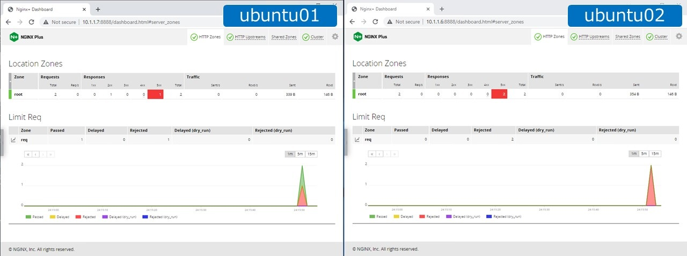
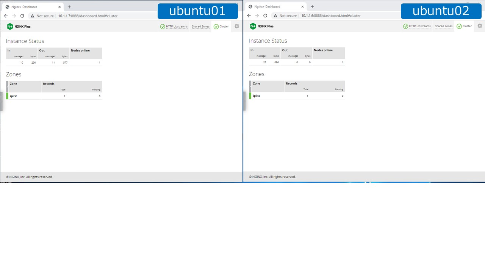

ステータス同期
####

ここでは、ステータス同期について紹介します。また具体的な利用サンプルとして Rate Limit、KeyValを紹介します

1. ステータス同期 (Zone Synchronization)
====

.. image:: ./media/nginx-ha-statesync-slide.jpg
   :width: 500

ステータス同期の設定を行います

``ubuntu01`` で以下の操作を行ってください

.. code-block:: cmdin

  sudo mv /etc/nginx/nginx.conf /etc/nginx/nginx.conf-bak
  sudo cp ~/f5j-nginx-plus-lab2-conf/lab/zone-sync01-nginx.conf /etc/nginx/nginx.conf
  sudo nginx -s reload

``ubuntu02`` で以下の操作を行ってください

.. code-block:: cmdin

  sudo mv /etc/nginx/nginx.conf /etc/nginx/nginx.conf-bak
  sudo cp ~/f5j-nginx-plus-lab2-conf/lab/zone-sync02-nginx.conf /etc/nginx/nginx.conf
  sudo nginx -s reload

NGINX Plus APIへ接続しステータス同期(Zone Synchronization)の状態を確認します。

.. code-block:: cmdin

  curl -s 127.0.0.1:8888/api/8/stream/zone_sync  | jq .

.. code-block:: bash
  :caption: 実行結果サンプル
  :linenos:

  {
    "status": {
      "nodes_online": 0,
      "msgs_in": 0,
      "msgs_out": 0,
      "bytes_in": 0,
      "bytes_out": 0
    },
    "zones": {}
  }

2. ratelimit
====

ステータス同期ができる機能の一つである Rate Limit を設定し、動作を確認します。

設定
----

設定を行います。

``ubuntu01`` 、 ``ubuntu02`` で以下の操作を行ってください

.. code-block:: cmdin

  sudo cp ~/f5j-nginx-plus-lab2-conf/lab/zone-sync-ratelimit.conf /etc/nginx/conf.d/default.conf
  sudo nginx -s reload

設定の内容を確認します

.. code-block:: cmdin

  cat ~/f5j-nginx-plus-lab2-conf/lab/zone-sync-ratelimit.conf

.. code-block:: bash
  :caption: 実行結果サンプル
  :linenos:
  :emphasize-lines: 1,14

  limit_req_zone $remote_addr zone=req:1M rate=1r/m sync;
  
  upstream server_group {
      zone backend 64k;
  
      server backend1:81;
  }
  
  server {
     listen 80;
     #status_zone server;
     location / {
         status_zone root;
         limit_req zone=req;
         proxy_pass http://server_group;
     }
  }

- 1行目、14行目でRate Limitの設定を行っています
- 1行目の末尾に ``sync`` を指定することで、Rate Limitの状態を動悸することが可能となります

NGINX Plus APIへ接続しステータス同期(Zone Synchronization)の状態を確認します。
リクエストリミットを設定することで、カウンターが増加していることが確認できます

.. code-block:: cmdin

  curl -s 127.0.0.1:8888/api/8/stream/zone_sync  | jq .

.. code-block:: bash
  :caption: 実行結果サンプル
  :linenos:

  {
    "status": {
      "nodes_online": 1,
      "msgs_in": 1,
      "msgs_out": 0,
      "bytes_in": 29,
      "bytes_out": 0
    },
    "zones": {
      "req": {
        "records_total": 0,
        "records_pending": 0
      }
    }
  }

ダッシュボードを開き状態を確認します。
F5ラボ環境を利用の場合、以下のどちらかの手段で接続してください

- ``(推奨)リモートデスクトップに接続している場合`` 

  - ``ubuntu01`` `http://10.1.1.7:8888/dashboard.html <http://10.1.1.7:8888/dashboard.html>`__ を開いてください
  - ``ubuntu02`` `http://10.1.1.6:8888/dashboard.html <http://10.1.1.6:8888/dashboard.html>`__ を開いてください

- ``リモートデスクトップを利用していない場合`` 

  - ご利用の端末から接続するため、 ``ubuntu01`` 、 ``ubuntu02`` の接続メニューより ``PLUS  DASHBOARD`` を選択してください

動作確認
----

``ubuntu01`` から、 ``ubuntu01(10.1.1.7)`` / ``ubuntu02(10.1.1.6)`` 双方に対して接続を行います。
以下の操作を行ってください

.. code-block:: cmdin

  echo "== To ubuntu01 =="
  for i in {1..2}; do echo "==$i==" ; curl -I -s 10.1.1.7 ; done
  sleep 1;
  echo "== To ubuntu02 =="
  for i in {1..2}; do echo "==$i==" ; curl -I -s 10.1.1.6  ; done

``ubuntu01`` 宛に接続した後、ステータス同期を待つため ``1秒停止(sleep 1)`` した後、 ``ubuntu02`` へ接続します

.. code-block:: bash
  :caption: 実行結果サンプル
  :linenos:
  :emphasize-lines: 5,13,25,33

  $ echo "== To ubuntu01 =="
  == To ubuntu01 ==
  $ for i in {1..2}; do echo "==$i==" ; curl -I -s 10.1.1.7 ; done
  ==1==
  HTTP/1.1 200 OK
  Server: nginx/1.21.6
  Date: Thu, 29 Sep 2022 00:15:49 GMT
  Content-Type: application/octet-stream
  Content-Length: 65
  Connection: keep-alive
  
  ==2==
  HTTP/1.1 503 Service Temporarily Unavailable
  Server: nginx/1.21.6
  Date: Thu, 29 Sep 2022 00:15:49 GMT
  Content-Type: text/html
  Content-Length: 197
  Connection: keep-alive
  
  $ sleep 1;
  $ echo "== To ubuntu02 =="
  == To ubuntu02 ==
  $ for i in {1..2}; do echo "==$i==" ; curl -I -s 10.1.1.6  ; done
  ==1==
  HTTP/1.1 503 Service Temporarily Unavailable
  Server: nginx/1.21.6
  Date: Thu, 29 Sep 2022 00:15:50 GMT
  Content-Type: text/html
  Content-Length: 197
  Connection: keep-alive
  
  ==2==
  HTTP/1.1 503 Service Temporarily Unavailable
  Server: nginx/1.21.6
  Date: Thu, 29 Sep 2022 00:15:50 GMT
  Content-Type: text/html
  Content-Length: 197
  Connection: keep-alive

- ``ubuntu01`` に対して接続した結果を確認すると、5行目の1回目が ``200`` 、13行目の2回目が ``503`` となり RateLimitにより通信が拒否されています
- ``ubuntu02`` に対して接続した結果を確認すると、25行目の1回目、33行目が2回目の双方が ``503`` となり RateLimitにより通信が拒否されています。これはステータスが同期されたためこのような動作となります

ダッシュボードの状態を確認します

- ``HTTP Zones`` のタブの内容を開きます。左が ``ubuntu01`` 、右が ``ubuntu02`` となります。
- 通信の結果、 ``5xx`` の結果を確認すると ``ubuntu01`` に ``1`` 、 ``ubuntu02`` が ``2`` となっていることがわかります
- ``Limit Req`` のグラフを見ると、 ``ubuntu02`` は通信の許可がなく ``Rejected`` されていることがわかります

3. Key Value Store
====

KeyValue Storeのステータス動機を確認します

設定
----
設定を行います。

``ubuntu01`` 、 ``ubuntu02`` で以下の操作を行ってください

.. code-block:: cmdin

  sudo cp ~/f5j-nginx-plus-lab2-conf/lab/zone-sync-keyval.conf /etc/nginx/conf.d/default.conf
  sudo nginx -s reload

設定の内容を確認します

.. code-block:: cmdin

  cat ~/f5j-nginx-plus-lab2-conf/lab/zone-sync-keyval.conf

.. code-block:: bash
  :caption: 実行結果サンプル
  :linenos:
  :emphasize-lines: 1-2,14-17,19-21,23-25

  keyval_zone zone=iplist:32k state=/etc/nginx/conf.d/iplists.keyval timeout=20s sync;
  keyval $arg_user $permit_ip zone=iplist;
  
  upstream server_group {
      zone backend 64k;
  
      server backend1:81;
  }
  
  server {
     listen 80;
     location / {
  
         # check variable is blank
         if ( $arg_user = "" ) {
           return 403 "No Username";
         }
  
         if ( $permit_ip = "" ) {
           set $permit_ip $remote_addr;
         }
  
         if ( $remote_addr != $permit_ip ) {
           return 403 "Mismatch client IP address";
         }
  
         # Here, we have arg_user & remote_addr = permit_ip
         proxy_pass http://server_group;
     }
  }

- 1-2行目でKeyValを指定しています。1行目の末尾に ``sync`` を指定することで、複数のNGINXでステータスが同期されます
- また ``sync`` を指定する場合は、 ``timeout`` の指定が必要となります。 ``timeout`` は各エントリの残存期間を示し、指定の時間を経過するとエントリが削除されます
- 2行目で KeyValの内容を指定します。 ``$arg_user`` が　Key となり、 ``$permit_ip`` が Valとなります。ステータス同期がなされたNGINXは、 ``Key`` を指定することで、KeyVal内の ``Val`` を参照し、指定の変数名でアクセスすることが可能となります。 ``Val`` の値は参照されるまでに適切に変数として格納する必要がありますので注意ください
- その他の ``if`` などは以下の挙動を実装するため指定しています

このサンプル設定では以下のような挙動となります

- URLパラメータとして ``user`` という名称のパラメータが指定されていない通信を拒否します
- ``user`` のURLパラメータの値を ``ユーザ`` とします。パラメータが指定されている場合、 ``接続元のIPアドレス`` を ``ユーザ`` に紐づけてKeyValueに登録します
- 同 ``ユーザ`` からのアクセスに置いて、異なる ``接続元のIPアドレス`` である場合、通信を拒否します

動作確認
----

``ubuntu01`` で ``iplist`` という名称のKeyValが生成されていることが確認できます

.. code-block:: cmdin

  curl -s 127.0.0.1:8888/api/8/http/keyvals | jq .

.. code-block:: bash
  :caption: 実行結果サンプル
  :linenos:

  {
    "iplist": {}
  }

``ubuntu01`` でサンプルのリクエストを送信し、KeyVal の結果を確認します

.. code-block:: cmdin

  curl 10.1.1.7/; echo"" ; curl -s 127.0.0.1:8888/api/8/http/keyvals | jq .

.. code-block:: bash
  :caption: 実行結果サンプル
  :linenos:

  No Username
  {
    "iplist": {}
  }

- リクエストで ``user`` を指定しないため、応答が ``No Username`` となります。
- ``iplist`` にエントリは追加されていません

``ubuntu01`` でURLパラメータに ``user`` を含むサンプルのリクエストを送信し、KeyVal の結果を確認します

.. code-block:: cmdin

  curl 10.1.1.7/?user=user1 ; echo"" ; curl -s 127.0.0.1:8888/api/8/http/keyvals | jq .

.. code-block:: bash
  :caption: 実行結果サンプル
  :linenos:

  { "request_uri": "/?user=user1","server_addr":"10.1.1.8","server_port":"81"}
  {
    "iplist": {
      "user1": "10.1.1.7"
  }

- 正しくURLパラメータの ``user`` に ``user1`` が指定されているため、正しい応答が確認できます
- ``iplist`` に ``ubuntu01`` のIPアドレス 10.1.1.7 が追加されていることが確認できます

``ubuntu02`` でURLパラメータに ``user`` を含むサンプルのリクエストを送信し、KeyVal の結果を確認します

.. code-block:: cmdin

  curl 10.1.1.7/?user=user1 ; echo"" ; curl -s 127.0.0.1:8888/api/8/http/keyvals | jq .

.. code-block:: bash
  :caption: 実行結果サンプル
  :linenos:
  
  Mismatch client IP address
  {
    "iplist": {
      "user1": "10.1.1.7"
    }
  }

- URLパラメータの ``user`` に ``user1`` が指定されていますが、 ``Mismatch client IP address`` が応答されています
- ``iplist`` をみると ``ubuntu01`` のIPアドレス 10.1.1.7 が追加されており、 ``ubuntu02`` のアドレスと一致しないためエラーとなったことがわかります

このように、KeyVal を利用することで、複雑な処理が可能となります。
またステータス同期により複数のホストで状態を同期し、協調した処理を行うことが可能となります

画像を確認いただくとカウンターの値が表示さています。
この数についての詳細ですが、この数はKeyvalのエントリが追加されたタイミングでのKeyの数を指しています。
一定時間経過後(今回の設定サンプルでは20秒)で各エントリが消えますが、そのタイミングで値は変化しません。
その後、新たにエントリの追加(または削除)を行った際に、全体の数の値が変更となります

4. APIを使ったKeyValの操作
====

KeyValの機能は、NGINX Plus APIを使って外部から操作することが可能です。

詳細は以下のページを参照してください

- `API /http/keyvals/{httpKeyvalZoneName} <http://nginx.org/en/docs/http/ngx_http_api_module.html#http_keyvals_http_keyval_zone_name>`__

以下のコマンドを実行し動作を確認してください

追加
----

``POST`` Method を利用し、エントリを ``追加`` します

.. code-block:: cmdin

  curl -s 127.0.0.1:8888/api/8/http/keyvals/iplist -X POST -d '{
     "user1":"10.0.0.1" ,
     "user2":"10.0.0.2" ,
     "user3":"10.0.0.3" ,
     "user4":"10.0.0.4" 
  }'

KeyValの状態を確認します

.. code-block:: cmdin

  curl -s 127.0.0.1:8888/api/8/http/keyvals | jq .

.. code-block:: bash
  :caption: 実行結果サンプル
  :linenos:

  {
    "iplist": {
      "user2": "10.0.0.2",
      "user3": "10.0.0.3",
      "user4": "10.0.0.4"
    }
  }

変更
----

``PATCH`` Method を利用し、エントリを ``変更`` します

.. code-block:: cmdin

  curl -s 127.0.0.1:8888/api/8/http/keyvals/iplist -X PATCH -d '{ "user1":"192.168.0.1" }'

KeyValの状態を確認します

.. code-block:: cmdin

  curl -s 127.0.0.1:8888/api/8/http/keyvals | jq .

.. code-block:: bash
  :caption: 実行結果サンプル
  :linenos:

  {
    "iplist": {
      "user2": "10.0.0.2",
      "user3": "10.0.0.3",
      "user1": "192.168.0.1",
      "user4": "10.0.0.4"
    }
  }

エントリの削除
----

``PATCH`` Method で、特定エントリの値として ``null`` を指定することで、対象のエントリを削除することができます

.. code-block:: cmdin

  curl -s 127.0.0.1:8888/api/8/http/keyvals/iplist -X PATCH -d '{ "user1":null }'

KeyValの状態を確認します

.. code-block:: cmdin

  curl -s 127.0.0.1:8888/api/8/http/keyvals | jq .

.. code-block:: bash
  :caption: 実行結果サンプル
  :linenos:

  {
    "iplist": {
      "user2": "10.0.0.2",
      "user3": "10.0.0.3",
      "user4": "10.0.0.4"
    }
  }

すべてのエントリの削除
----

``DELETED`` Method を利用し、すべてのエントリを ``削除`` します

.. code-block:: cmdin

  curl -s 127.0.0.1:8888/api/8/http/keyvals/iplist -X DELETE 

KeyValの状態を確認します

.. code-block:: cmdin

  curl -s 127.0.0.1:8888/api/8/http/keyvals | jq .

.. code-block:: bash
  :caption: 実行結果サンプル
  :linenos:

  {
    "iplist": {}
  }

4. その他冗長構成
====

本番環境では、対向のホストをFQDNで指定し、mTLS・証明書認証などを実装することが考えられます。
これらの設定について以下のページを参照してください

- `Runtime State Sharing in a Cluster <https://docs.nginx.com/nginx/admin-guide/high-availability/zone_sync/>`__

